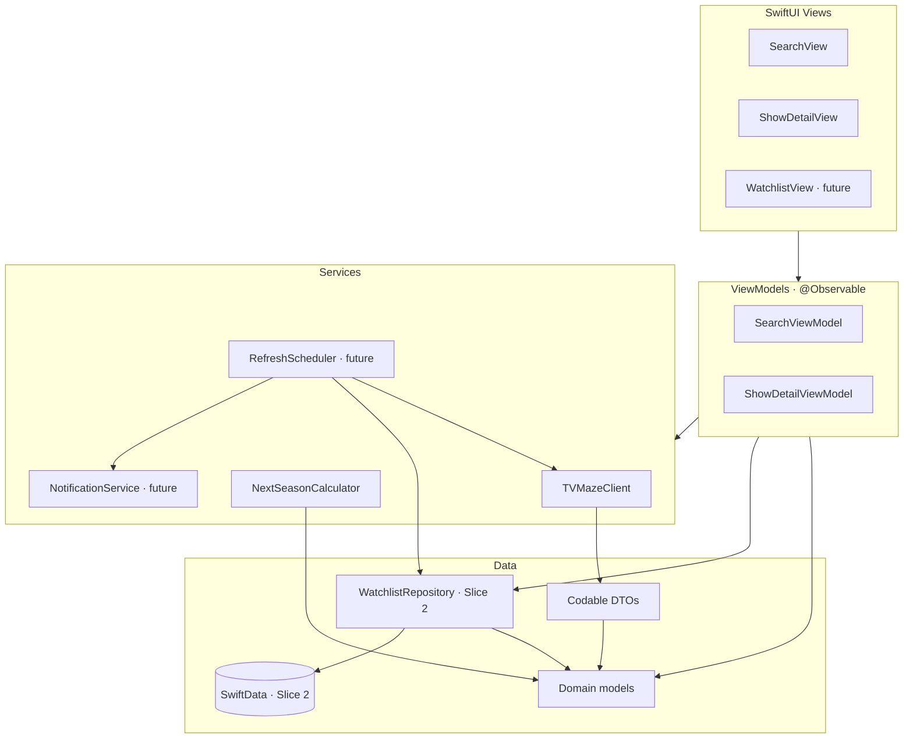

# Architecture

Phase 3 architecture for NextSeason. Defines the data model, persistence,
networking, notification, and testing strategies. No implementation yet — this
document is the blueprint reviewed before Phase 4 (vertical slices).

Companion docs: [`ProductSpec.md`](ProductSpec.md),
[`TVMazeResearch.md`](TVMazeResearch.md).

---

## 1. Guiding principles

From `AGENTS.md` and the Cursor rules:

- iOS 26+, Swift 6.2+, strict concurrency, `async/await` over callbacks.
- SwiftUI + MVVM. Business logic lives in view models / services, not views.
- SwiftData for local persistence.
- No third-party dependencies, no UIKit (without approval).
- Prefer simple, readable code. No abstraction without a present need.
- Files under 500 lines; views kept small; accessibility required.

The architecture is intentionally sized for **Slice 1 (Guest Search)** while
leaving an obvious, low-friction path to **Slice 2 (Save & Notify)**. We build the
Slice 1 pieces now and stub nothing we don't use yet. (Terminology — MVP vs.
slices — is defined in [`ProductSpec.md`](ProductSpec.md).)

---

## 2. Layering



**Three model tiers, kept deliberately separate:**

1. **DTOs** — `Codable` structs mirroring TVMaze JSON exactly. Network-only.
2. **Domain models** — clean Swift types the app reasons about
   (`Show`, `Season`, `NextSeasonStatus`). UI binds to these.
3. **Persistence models** — SwiftData `@Model` classes (future, for saved shows).

Separating DTOs from domain models means API quirks (HTML summaries, open-ended
`status`, embedded payloads) never leak into the UI, and the API can change
without touching views.

---

## 3. Domain model

```swift
struct Show: Identifiable, Sendable, Hashable {
    let id: Int                 // TVMaze show id
    let name: String
    let summaryPlainText: String?   // HTML stripped
    let posterMediumURL: URL?
    let posterOriginalURL: URL?
    let status: ShowStatus
    let premiered: Date?
    let ended: Date?
    let network: String?        // network ?? webChannel name
    let seasons: [Season]
    let updatedAt: Date         // from `updated` epoch
}

enum ShowStatus: Sendable, Hashable {
    case running, ended, toBeDetermined, inDevelopment
    case unknown(String)        // never crash on a new TVMaze value
}

struct Season: Identifiable, Sendable, Hashable {
    let id: Int
    let number: Int
    let premiereDate: Date?
    let endDate: Date?
    let episodeOrder: Int?
}

enum NextSeasonStatus: Sendable, Hashable {
    case airing(season: Int)
    case scheduled(season: Int, premiere: Date)
    case announcedUndated(season: Int)
    case returningNoSeasonYet
    case ended
    case unknown
}
```

`NextSeasonStatus` is produced by `NextSeasonCalculator` (see §6) and is the
single value the detail screen renders and that future polling diffs against.

---

## 4. Networking — `TVMazeClient`

A small `actor` (or a `Sendable` struct with an injected `URLSession`) exposing
async methods. An actor gives us safe shared state (e.g. a simple in-memory
cache) for free under Swift 6 concurrency.

```swift
protocol TVMazeService: Sendable {
    func searchShows(matching query: String) async throws -> [Show]
    func show(id: Int) async throws -> Show          // embeds seasons + nextepisode
    func updatedShowIDs(since: UpdateWindow) async throws -> [Int: Date]  // future
}
```

Design points:

- **One shared `URLSession`** with a custom `User-Agent`
  (`NextSeason/<version>`), per TVMaze guidance. No idle-connection sprawl.
- **JSONDecoder** with a custom date strategy: TVMaze mixes date-only
  (`premiereDate`) and full timestamps (`airstamp`); decode dates leniently in
  the DTO layer.
- **Embedding**: `show(id:)` always requests
  `?embed[]=seasons&embed[]=nextepisode` so one request fully populates a `Show`.
- **Error handling** maps to a typed `TVMazeError`:
  `network`, `decoding`, `rateLimited(retryAfter:)`, `notFound`, `server`.
- **Rate limiting**: on `429`, back off briefly and retry once or twice; surface
  `rateLimited` only if retries are exhausted.
- **Search debounce** happens in the view model, not the client.
- **Attribution**: the client is not responsible for UI credit, but the app must
  display "Data by TVMaze" (CC BY-SA) — tracked as a UI requirement.

DTO → domain mapping lives in a dedicated mapping layer so views never see
`Codable` types.

---

## 5. Presentation — MVVM with `@Observable`

```swift
@Observable
final class SearchViewModel {
    enum State { case idle, loading, results([Show]), empty, failed(String) }
    private(set) var state: State = .idle
    var query: String = ""
    private let service: TVMazeService
    // debounce query -> service.searchShows -> map to State
}
```

- View models are `@MainActor`, hold `@Observable` state, depend on the
  `TVMazeService` **protocol** (injected) so they're testable with a mock.
- Views are thin: render `state`, forward user intent. Explicit
  `loading / empty / failed` states satisfy the "clear empty/error states"
  requirement (US-001, MVP scope).
- Networking runs off the main actor inside the client; only state mutation hops
  back to `@MainActor`.

---

## 6. Next-season logic — `NextSeasonCalculator`

A **pure, dependency-free** function:

```swift
enum NextSeasonCalculator {
    static func status(for show: Show, now: Date = .now) -> NextSeasonStatus
}
```

- Implements the algorithm in `TVMazeResearch.md` §4.
- Pure + deterministic (inject `now`) → trivially unit-testable with fixtures and
  the single highest-value test target in the project.
- Used by both the detail screen (Slice 1) and the Slice 2 polling diff, so the
  "what counts as a new season" rule lives in exactly one place.

---

## 7. Persistence — repository over SwiftData (Slice 2)

Not built in Slice 1 (guest search needs no storage), but the strategy is decided
now (Phase 3 deliverable) so Slice 2 drops in cleanly.

**Engine: SwiftData.** Native to iOS 26, no third-party dependency, and
`@Attribute(.unique)` enforces "no duplicate watchlist entries" (FR-005) at the
store level.

**Access: a repository protocol.** View models and services depend on the
protocol, never on SwiftData directly. The justification is a *present-day* need —
testability and the DTO/domain/persistence layering this doc already commits to —
not hypothetical future swapping (we don't add abstractions speculatively). That
the engine could later be swapped is a free side effect.

The repository deals exclusively in **domain types** (`TrackedShow` struct); the
`@Model` class is a private persistence detail mapped to/from the domain type, so
SwiftData never leaks past this layer.

```swift
// Domain type the rest of the app sees
struct TrackedShow: Identifiable, Sendable, Hashable {
    let id: Int                       // TVMaze show id
    var name: String
    var posterMediumURL: URL?
    var status: ShowStatus
    var nextSeason: NextSeasonStatus  // last computed snapshot
    var sourceUpdatedAt: Date         // TVMaze `updated` epoch
    var lastCheckedAt: Date
    var lastNotifiedSignature: String?   // dedup guard (FR-013, FR-018)
    var dateAdded: Date
}

protocol WatchlistRepository: Sendable {
    func all() async throws -> [TrackedShow]
    func contains(showID: Int) async throws -> Bool
    func add(_ show: Show) async throws            // maps domain Show -> stored row
    func remove(showID: Int) async throws
    func updateSnapshot(forShowID id: Int,
                        status: NextSeasonStatus,
                        sourceUpdatedAt: Date,
                        notifiedSignature: String?) async throws
}

// Implementations:
//   SwiftDataWatchlistRepository  — wraps ModelContext + a private @Model row
//   InMemoryWatchlistRepository   — tests & SwiftUI previews
```

```swift
// Private to SwiftDataWatchlistRepository — never exposed
@Model
final class TrackedShowEntity {
    @Attribute(.unique) var tvMazeID: Int
    var name: String
    var posterMediumURL: URL?
    var statusRaw: String
    var nextSeasonSnapshot: Data       // encoded NextSeasonStatus
    var sourceUpdatedAt: Date
    var lastCheckedAt: Date
    var lastNotifiedSignature: String?
    var dateAdded: Date
    init(...) { ... }
}
```

Notes & trade-offs:

- **Trade-off accepted:** dealing in domain structs means we forgo SwiftData's
  `@Query` live-binding in views and do explicit fetches driven by `@Observable`
  state. For an infrequently-changing watchlist this cost is negligible, and we
  gain a trivially mockable boundary (`InMemoryWatchlistRepository`) for tests and
  previews.
- The next-season snapshot + `lastNotifiedSignature` are what Slice 2's
  change-detection diffs against, so dedup survives relaunches (FR-013, FR-018).
- `ModelContainer` is created at the app root; `SwiftDataWatchlistRepository`
  receives a `ModelContext`. The container/context never appear in the networking
  or calculator layers.

---

## 8. Notifications (future)

- **`NotificationService`** wraps `UNUserNotificationCenter`:
  permission request, scheduling local notifications, and tap handling that
  routes to the relevant show.
- **Permission flow** is gentle (US-008): explain value before prompting; the app
  remains fully usable if denied.
- **Local notifications only** for the MVP — no push server, matching the
  "no backend" decision (PD-001). Content names the show; tapping opens it.

### Background refresh — `RefreshScheduler`

- **`BGTaskScheduler`** with a `BGAppRefreshTask`, target cadence ~12h.
- **Constraint (documented honestly):** iOS treats background refresh as
  best-effort; the system decides actual run time based on usage/battery. "Every
  12h" is a target, not a guarantee. Notifications may lag the real-world event.
- Each run: `/updates/shows?since=day` → fetch only changed saved shows →
  recompute `NextSeasonStatus` → diff → notify → update snapshots. (See
  `TVMazeResearch.md` §5.)

### Reliability-driven notification rules

TVMaze data is crowd-sourced and editable, so a single poll can reflect a
transient or incorrect edit (`TVMazeResearch.md` §6.3–6.4). To avoid false or
premature alerts:

- **Debounce / confirm before notifying.** Only emit a notification for a change
  that is *durable* — either it persists across two consecutive polls, or it is
  backed by a concrete `premiereDate` / `airstamp` rather than a status string
  alone. This trades a little timeliness for trustworthiness.
- **Dedup signature** (`lastNotifiedSignature`) guarantees we never notify twice
  for the same transition and limits the blast radius of a value that flaps.
- **Graceful staleness.** A saved show can be deleted/merged on TVMaze; a refresh
  may return `404`. Mark the show stale and surface it calmly in the UI — never
  crash or silently drop it. Treat `429`/`5xx` as transient and retry next cycle.
- **Honest UI.** Show a "last updated" timestamp and the required "Data by TVMaze"
  attribution so users can calibrate trust.

---

## 9. Testing strategy

Framework: **Swift Testing** (`@Test`, `#expect`), per project skills.

| Layer                  | What we test                                                              | How                                            |
| ---------------------- | ------------------------------------------------------------------------ | ---------------------------------------------- |
| `NextSeasonCalculator` | Every `NextSeasonStatus` branch + edge cases (soaps, revivals, season 0) | Pure unit tests with hand-built `Show` values  |
| DTO decoding           | Real TVMaze payloads decode correctly                                    | Saved JSON fixtures (Severance, GoT, soap)     |
| DTO → domain mapping   | HTML stripped, status mapped, URLs parsed, dates parsed                  | Unit tests over fixtures                       |
| View models            | State transitions: idle → loading → results/empty/failed                 | Inject a mock `TVMazeService`                  |
| Change detection       | Correct notification triggers; no duplicates                             | Snapshot-in / status-out unit tests            |

- The `TVMazeService` protocol enables a deterministic mock — no live network in
  tests.
- Capture real API responses as committed JSON fixtures so decoding stays honest
  even as the live API evolves.
- The pure calculator + diff logic are the backbone of the test suite and the
  clearest demonstration of testable design for the portfolio.

---

## 10. Proposed file layout

```
NextSeason/
├── App/
│   └── NextSeasonApp.swift
├── Models/
│   ├── Domain/        // Show, Season, ShowStatus, NextSeasonStatus
│   └── DTO/           // ShowData, SeasonData, SearchResultData, ... (Data suffix in code)
├── Services/
│   ├── TVMazeClient.swift
│   ├── NextSeasonCalculator.swift
│   ├── NotificationService.swift   // future
│   └── RefreshScheduler.swift      // future
├── Features/
│   ├── Search/        // SearchView + SearchViewModel
│   ├── ShowDetail/    // ShowDetailView + ShowDetailViewModel
│   └── Watchlist/     // future
└── Persistence/                    // Slice 2
    ├── WatchlistRepository.swift       // protocol + domain TrackedShow
    ├── SwiftDataWatchlistRepository.swift
    ├── InMemoryWatchlistRepository.swift
    └── TrackedShowEntity.swift         // private @Model
NextSeasonTests/
    ├── NextSeasonCalculatorTests.swift
    ├── DecodingTests.swift + Fixtures/
    └── SearchViewModelTests.swift
```

---

## 11. Decisions & rationale (summary)

| Decision                                        | Rationale                                                                      |
| ----------------------------------------------- | ----------------------------------------------------------------------------- |
| Separate DTO / domain / persistence tiers       | Isolates API quirks; keeps views and tests clean.                             |
| `TVMazeClient` as an `actor` behind a protocol  | Safe shared state under Swift 6; injectable mock for tests.                    |
| `NextSeasonCalculator` is a pure function       | One source of truth for "next season"; fully unit-testable.                   |
| SwiftData behind a `WatchlistRepository`        | Testable, mockable boundary now; engine swap is a free side effect. Slice 1 stays storage-free; built in Slice 2. |
| Local notifications + `BGTaskScheduler`         | No backend (PD-001); honest about iOS best-effort scheduling.                 |
| Debounced, date-backed notifications            | Crowd-sourced data can flap; confirm durable changes before alerting (PD-008). |
| Swift Testing, fixture-based decoding           | Modern API; deterministic, portfolio-quality tests with no live network.      |

---

## 12. Open questions (resolve during Phase 4 implementation)

These are deferred implementation choices, not Phase 5 review items.

- **Resolved:** persistence = SwiftData behind a `WatchlistRepository` protocol,
  built in Slice 2; Slice 1 ships storage-free. (See §7, PD-007.)
- Slice 1: `summary` HTML — strip to plain text vs. render as `AttributedString`?
- Slice 1: lightweight in-memory response caching in `TVMazeClient`, or rely
  solely on TVMaze's 60-min edge cache?
- Slice 2: exact notification copy and the precise set of "meaningful change"
  triggers.
```