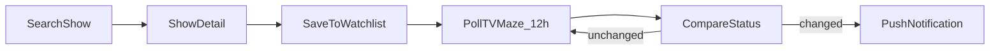
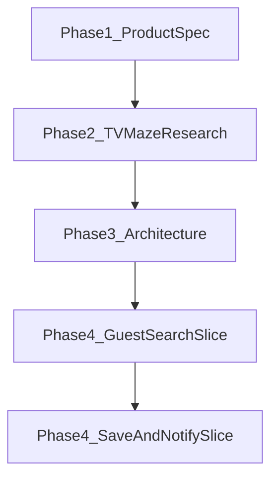

# Phase 1 — Product Definition

## Current state

- [ProjectKickoff.md](Development Documentation/ProjectKickoff.md) establishes the workflow: **Phase 1 = product definition before code**.
- [AGENTS.md](AGENTS.md) has a rough one-liner: guest search + logged-in save/notify, using TVMaze.
- The app is still the Xcode template ([ContentView.swift](NextSeason/ContentView.swift) — "Hello, world!").
- No `ProductSpec.md` exists yet. Phase 2/3 docs (`TVMazeResearch.md`, `Architecture.md`) are also not started — correctly deferred.

## Decisions captured from this session

| Decision                        | Choice                                                                                                                                                             |
| ------------------------------- | ------------------------------------------------------------------------------------------------------------------------------------------------------------------ |
| **v0.1 MVP**                    | **A — Guest search only**: look up a show, see next-season status/date. No accounts, no saves, no push.                                                            |
| **North star (soon)**           | **C — Full core loop**: search → login → save shows → notifications. Design Phase 1 so this path is obvious, but do not build it yet.                              |
| **Notification model (future)** | Poll TVMaze ~every 12 hours for saved shows; notify when **next-season status changes** (e.g. "TBA" → date announced, date changed, season confirmed ended, etc.). |

## Deliverable: `ProductSpec.md`

Create [Development Documentation/ProductSpec.md](Development Documentation/ProductSpec.md) as the single source of truth for Phase 1. Structure:

### 1. Target user

Primary persona: **a TV fan who finished the latest aired season and wants to know if/when the next one is coming** — without manually checking news sites, social media, or streaming apps.

Secondary traits (inform UX, not MVP blockers):

- Cord-cutter / multi-platform viewer
- Follows several shows at once (relevant for Phase C, not v0.1)

### 2. Problem being solved

**Core pain:** Next-season information is fragmented, inconsistent, and easy to miss. Users want a single place to answer: *"Is there a next season, and when?"*

**v0.1 solves:** On-demand lookup for any show.

**Future solves:** Passive monitoring — "tell me when something changes for shows I care about."

### 3. MVP scope (v0.1 — guest search only)

**In scope:**

- Search TV shows by name (TVMaze)
- Show detail with **next-season status**, including when available:
  - Next season number (if known)
  - Premiere date (if known)
  - Status label when no date exists (e.g. "In Production", "TBA", "Ended", "No next season known")
- Clear empty/error states (no results, network failure, show ended)
- Works without login or account

**Explicitly out of scope for v0.1** (but documented as planned next):

- User accounts / Sign in with Apple
- Saved watchlist
- Push notifications
- Background polling

### 4. Non-goals (project-wide, not just v0.1)

Document these to prevent scope creep during later phases:

- **Not a streaming guide** — no "where to watch" as a primary feature
- **Not a full episode tracker** — no watch-history or episode-level progress
- **Not a social app** — no comments, ratings, or friend feeds
- **Not multi-platform at launch** — iOS only
- **Not a TVMaze replacement** — we consume their data; we don't replicate their full catalog UX
- **Not real-time** — notifications (when built) are driven by periodic polling, not live webhooks

### 5. Future core loop (Phase C preview — for context only)

Keep this section short so Phase 1 doesn't bleed into architecture, but anchors later work:

**Status-change notification** means any meaningful delta in next-season fields, for example:

- No date → premiere date announced
- Premiere date updated
- Status changes (e.g. "In Development" → "In Production")
- Show transitions to "Ended" (no further seasons expected)

Exact field mapping and edge cases belong in **Phase 2** (`TVMazeResearch.md`), not Phase 1.

### 6. Phase 1 open questions (defer to Phase 2)

Do **not** answer these in ProductSpec with implementation detail — list them as research inputs:

- What next-season fields does TVMaze actually expose per show?
- How reliable/timely are premiere dates vs. status strings?
- What App Store / `UNUserNotificationCenter` constraints apply to background polling?
- What is the minimum auth mechanism for saved shows (likely Sign in with Apple)?

### 7. Success criteria for v0.1

Phase 1 is **done** when ProductSpec is written and you can answer "yes" to:

- Can a guest search "Severance" (or any show) and understand next-season status in one screen?
- Is it obvious what v0.1 does **not** do?
- Does the doc make the path to saved-shows + change-notifications clear without prescribing implementation?

## What we will NOT do in Phase 1

Per [ProjectKickoff.md](Development Documentation/ProjectKickoff.md):

- No Swift implementation
- No `Architecture.md` or data model design
- No TVMaze endpoint investigation (that's Phase 2)
- No test scaffolding

## Suggested log entry

After ProductSpec is written, add one entry to [DevelopmentLog.md](Development Documentation/DevelopmentLog.md):

- **Goal:** Phase 1 product definition
- **Decision:** v0.1 = guest search; future = 12h polling + status-change notifications
- **Follow-up:** Phase 2 TVMaze research

## Phase flow (where this fits)

Phase 4 first vertical slice = **guest search only**, aligned with MVP A.
