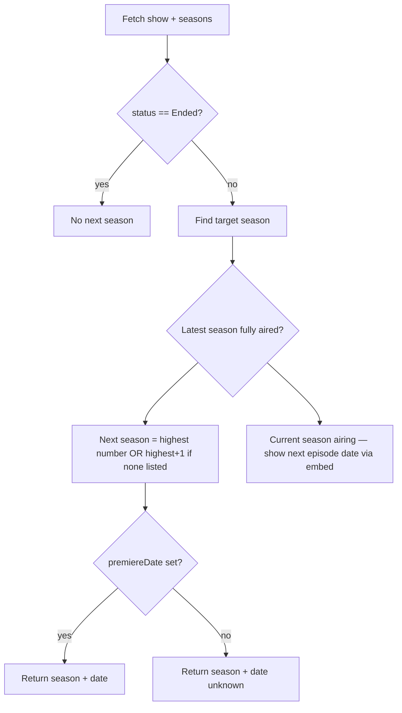

# Phase 2 — Research

## Goal

Per [ProjectKickoff.md](Documentation/ProjectKickoff.md), Phase 2 investigates **TVMaze capabilities**, **notification requirements**, **App Store constraints**, and **data availability** — with no implementation yet.

**Deliverable:** [Documentation/TVMazeResearch.md](Documentation/TVMazeResearch.md)

**Also update:** [Documentation/ProductSpec.md](Documentation/ProductSpec.md) (resolve Phase 2 open questions) and [Documentation/DevelopmentLog.md](Documentation/DevelopmentLog.md) (session entry).

---

## Key findings (from live API probes)

These will be documented with full examples in `TVMazeResearch.md`.

### TVMaze is viable for NextSeason

The public API exposes everything needed for v0.1 guest search and future status-change notifications.

| Need | Endpoint | Notes |
|---|---|---|
| Search | `GET /search/shows?q=` | Fuzzy match; returns full show objects. User picks from disambiguation list. |
| Show status | `GET /shows/:id` | `status`: Running, Ended, In Development, To Be Determined |
| Season list | `GET /shows/:id/seasons` | `number`, `premiereDate`, `endDate`, `episodeOrder` (nullable for future seasons) |
| Next episode (optional) | `GET /shows/:id?embed=nextepisode` | Only present when an upcoming episode is scheduled; absent between seasons |
| Efficient polling | `GET /updates/shows?since=day` | Returns `{showId: unixTimestamp}` for recently changed shows — critical for future watchlist polling |

**Rate limits:** ≥20 calls / 10 seconds per IP. Responses cached up to 60 minutes.

**License:** CC BY-SA — must link/credit TVMaze in the app.

### Real-world examples to document

| Show | Scenario | What TVMaze gives us |
|---|---|---|
| **Severance** (44933) | Between seasons; S3 confirmed, no date | `status: Running`; S3 exists with `premiereDate: null`; no `nextepisode` link |
| **House of the Dragon** (44778) | Next season has premiere date | S3 `premiereDate: 2026-06-21`; `embed=nextepisode` returns `airdate: 2026-06-21` |
| **Game of Thrones** (82) | Show ended | `status: Ended`; `ended: 2019-05-19` |

### Proposed next-season derivation (research conclusion, not code)

For any show, derive a **NextSeasonStatus** snapshot from `/shows/:id` + `/shows/:id/seasons`:



**Edge cases to document:**
- Season 0 = specials (exclude from "next season" logic)
- `To Be Determined` at show level = uncertain future, not a confirmed next season
- `In Development` = pre-premiere show (pilot hasn't aired)
- Future season row may exist before premiere date is known (Severance S3 pattern)
- `nextepisode` embed is a useful supplement but **not sufficient alone** — absent when between seasons

### Status-change fields for future notifications

Store a snapshot per saved show; notify when any of these change:

- `show.status`
- `show.ended`
- Next target season `number`
- Next target season `premiereDate`
- Next target season `endDate`
- Whether `nextepisode` exists and its `airdate` (if applicable)

Use `show.updated` (unix timestamp) as a cheap "maybe changed" signal before re-fetching seasons.

### Polling strategy recommendation (for Phase 3, not Phase 2 implementation)

The ProductSpec goal of **~12-hour polling** must be tempered by iOS reality:

| Mechanism | Reliability | Backend required? |
|---|---|---|
| `BGAppRefreshTask` | **Discretionary** — iOS decides when; not guaranteed every 12h | No |
| Foreground refresh (app open) | Reliable | No |
| `BGAppRefreshTask` + `/updates/shows` filter | Best no-backend approach | No |
| Silent push (`content-available`) | More reliable timing | **Yes** — requires server |

**Research conclusion:** For a no-backend MVP, use:
1. **Foreground refresh** on every app launch (always check saved shows)
2. **`BGAppRefreshTask`** as a supplement (request ~12h `earliestBeginDate`, accept iOS may delay)
3. **`/updates/shows?since=day`** to avoid re-fetching unchanged shows
4. **`UNUserNotificationCenter` local notifications** when a diff is detected (no APNs server needed)

**App Store / platform constraints to document:**
- Background tasks stop if user force-quits app until relaunched (WWDC25 / Apple docs)
- ~30 seconds max background execution time
- Notification permission required; explain value before prompting
- TVMaze attribution required (CC BY-SA)
- No special App Store category restrictions for this use case

**Auth (saved shows):** Defer detailed design to Phase 3; research note: Sign in with Apple is the likely choice for a native iOS watchlist, but v0.1 needs none.

---

## TVMazeResearch.md structure

```markdown
# TVMaze Research — NextSeason

## Summary & recommendation
## Endpoints we will use
## Show status values
## Deriving next-season status (with examples)
## Example shows (Severance, HotD, GoT)
## Change detection for notifications
## Polling & updates endpoint strategy
## Rate limits, caching, licensing
## iOS background & notification constraints
## Limitations & risks
## Open items for Phase 3 (Architecture)
## Phase 2 open questions — resolved
```

---

## ProductSpec updates

Replace the "Open questions (Phase 2 research)" section in [Documentation/ProductSpec.md](Documentation/ProductSpec.md) with brief **resolved answers** and a link to `TVMazeResearch.md`. Mark success criteria checkboxes that Phase 2 now supports.

---

## What we will NOT do in Phase 2

- No Swift code
- No `Architecture.md` (Phase 3)
- No data model or networking layer design (brief recommendations only)
- No test scaffolding

---

## Phase 3 handoff (preview)

After Phase 2, Architecture should decide:

- `NextSeasonStatus` value type and season-selection rules
- API client shape (`TVMazeClient` with search + show + seasons)
- SwiftData model for saved shows + last-known snapshot
- `BGAppRefreshTask` registration and refresh coordinator
- When to prompt for notification permission

---

## Verification

Phase 2 is done when `TVMazeResearch.md` answers every question listed in [ProductSpec.md](Documentation/ProductSpec.md) lines 99–102, with real API examples and honest iOS polling limitations documented.

