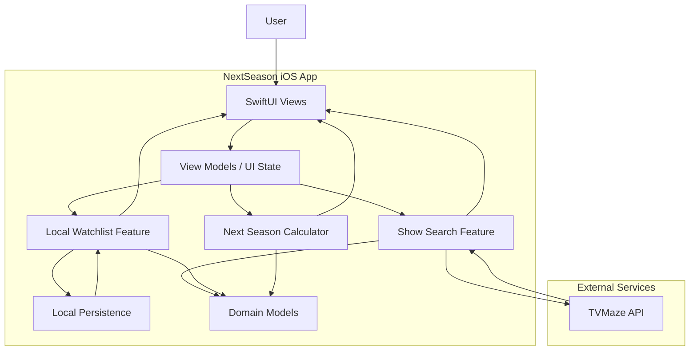

# NextSeason MVP System Architecture

## Purpose

This diagram shows the MVP as a local-first iOS app.

The app fetches show data from TVMaze, lets the user maintain a local watchlist, and uses local calculation logic to present useful season-status information. There is no account system or backend in the MVP.
