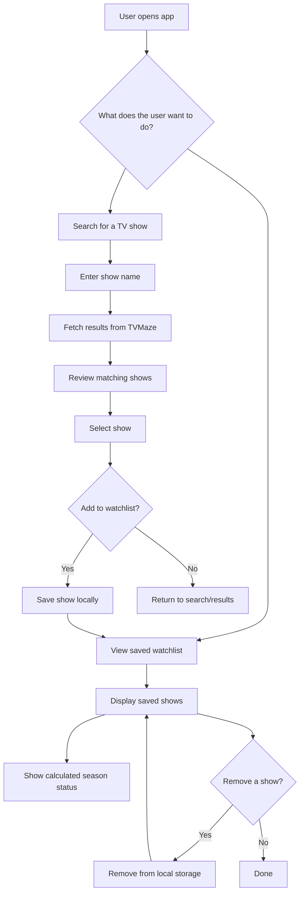

# NextSeason User Flows

```mermaid
flowchart TD
    Start[User opens app]

    Start --> Choice{What does the user want to do?}

    Choice --> Search[Search for a TV show]
    Choice --> ViewWatchlist[View saved watchlist]

    Search --> EnterQuery[Enter show name]
    EnterQuery --> FetchResults[Fetch results from TVMaze]
    FetchResults --> ReviewResults[Review matching shows]
    ReviewResults --> SelectShow[Select show]
    SelectShow --> AddToWatchlist{Add to watchlist?}

    AddToWatchlist -->|Yes| SaveShow[Save show locally]
    AddToWatchlist -->|No| EndSearch[Return to search/results]

    SaveShow --> ViewWatchlist

    ViewWatchlist --> ShowList[Display saved shows]
    ShowList --> SeasonStatus[Show calculated season status]
    ShowList --> RemoveShow{Remove a show?}

    RemoveShow -->|Yes| DeleteLocal[Remove from local storage]
    RemoveShow -->|No| Done[Done]

    DeleteLocal --> ShowList
```

## Purpose

This diagram focuses on the user’s mental model:

1. Find a show.
2. Save it.
3. Come back later to check what is going on with the next season.
