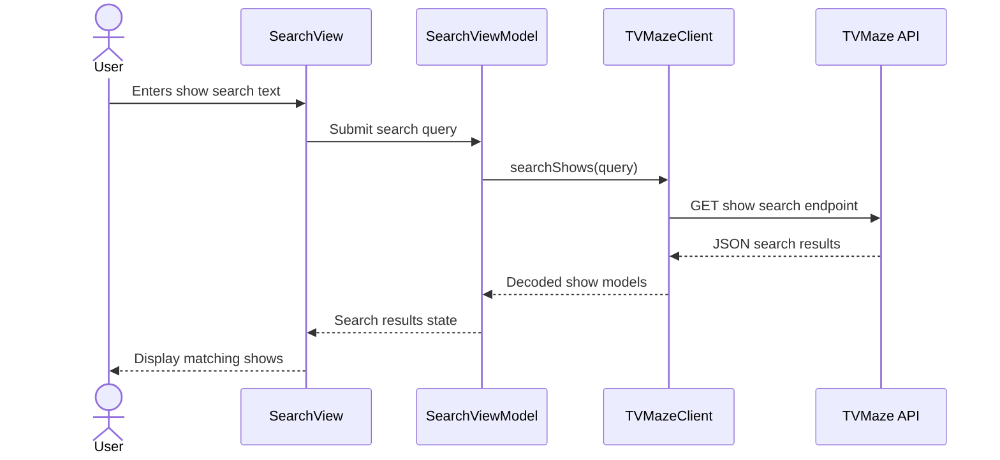

# Show Search Flow

## Purpose

This diagram shows the search path from user input to decoded TVMaze results.

The important boundary is `TVMazeClient`: the rest of the app should not need to know the details of URL construction, query items, HTTP requests, or JSON decoding.
