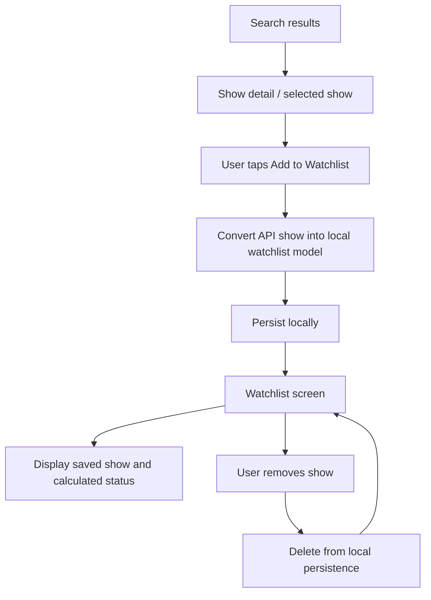

# Watchlist Flow

## Purpose

This diagram shows that the watchlist is local MVP state.

There is no sync, no login, and no account-owned watchlist yet. That keeps the MVP smaller and makes the app testable without backend infrastructure.
