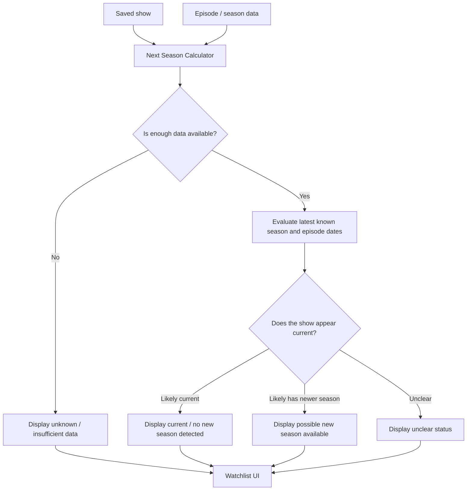

# Season Calculation Flow

## Purpose

This diagram intentionally avoids pretending the app has perfect knowledge.

TV data can be incomplete, delayed, or ambiguous. The calculator should produce useful status, but the UI should be honest when the data does not support certainty.
