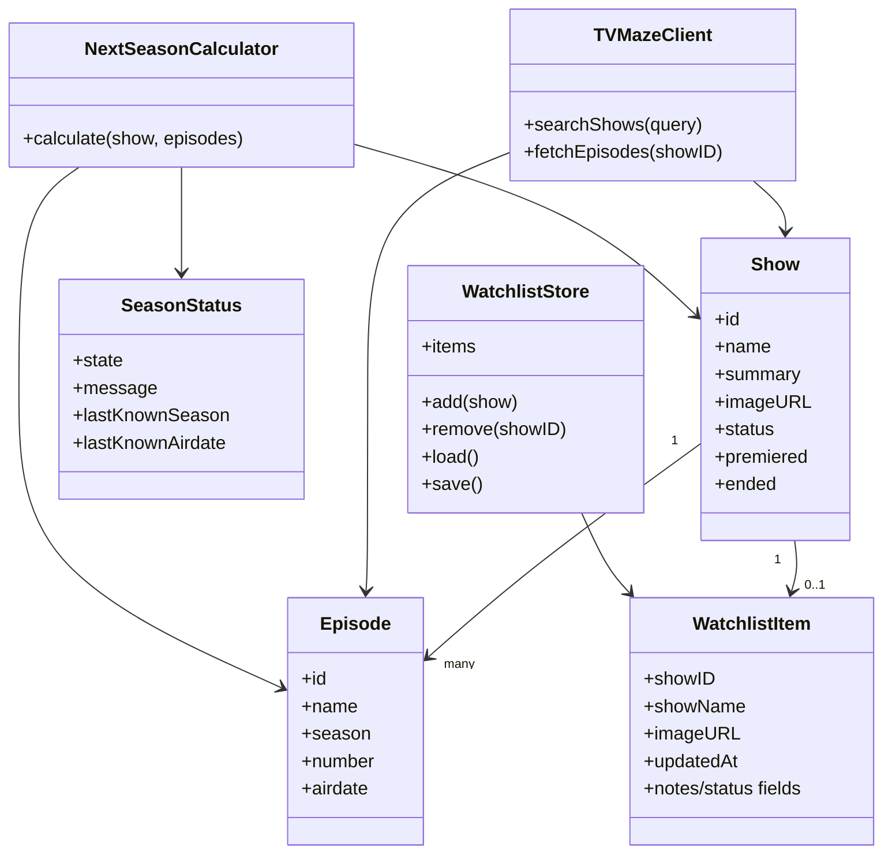

# Conceptual Data Model

## Purpose

This is a conceptual model, not necessarily a one-to-one copy of Swift files.

It shows the main things the app knows about:

- Shows from TVMaze
- Episodes/seasons from TVMaze
- Locally saved watchlist items
- Calculated season status
