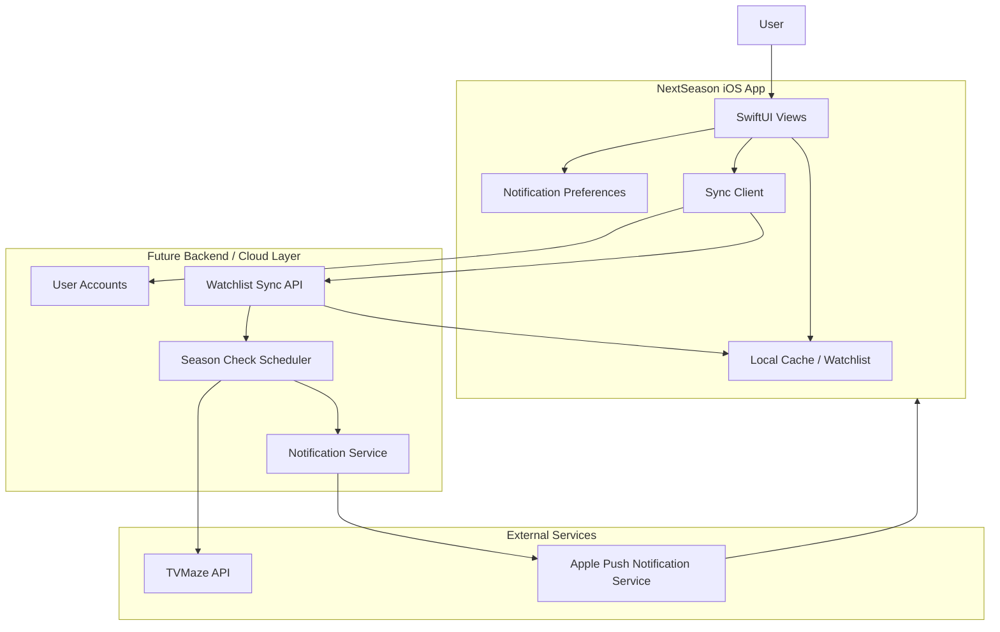

# Post-MVP Architecture

## Purpose

This diagram shows what a post-MVP version might add:

- User accounts
- Cloud-synced watchlists
- Scheduled background checks
- Push notifications

This is intentionally not part of the MVP. The MVP can prove the core value before adding account and notification complexity.
