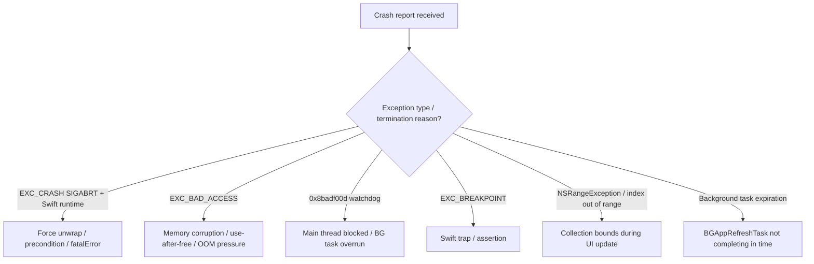

# Intermittent idle crash tracking

## User

Please help track an intermittent idle crash that can happen hours after launch.

Add/verify:
1. Xcode Organizer crash log collection for TestFlight/device builds
2. OSLog logging around:
   - app launch
   - scene phase changes
   - background/foreground transitions
   - wishlist persistence reads/writes
   - search/detail network requests
   - timer/task start and cancellation
   - any cache cleanup or refresh logic
3. Ensure every Task is cancellable and does not strongly retain view models unnecessarily.
4. Check for force unwraps, try!, fatalError, preconditionFailure, array index assumptions, and main-thread violations.
5. Add breadcrumbs so crash logs show the last meaningful app activity.
6. Run a long idle test on-device:
   - launch app
   - optionally populate wishlist
   - leave on Search tab for 6+ hours
   - repeat on Wishlist tab
   - repeat after backgrounding/foregrounding
7. During long idle test, collect:
   - crash log
   - device console logs
   - memory graph if memory rises
   - Instruments Allocations/Leaks if practical

Do not guess the cause. First identify the crash signature: exception type, crashed thread, top stack frames, and whether it is memory pressure, watchdog termination, Swift concurrency/runtime crash, force unwrap, collection bounds error, or background task issue.

## Assistant

## Status: instrumentation ready — crash signature not yet known

There is no crash log in this session, so **the root cause is unidentified**. What follows is the investigation setup, static audit, and how to capture the signature when the crash happens.

---

### 1. Xcode Organizer / TestFlight crash collection — verified

Release build settings are correct for symbolicated crashes:

- `DEBUG_INFORMATION_FORMAT = dwarf-with-dsym`
- `COPY_PHASE_STRIP = NO`

Run `./Scripts/verify-crash-reporting.sh` anytime to re-check.

**After a device/TestFlight crash:**

1. Xcode → **Window → Organizer → Crashes**
2. Select the matching build version (dSYMs upload with Archive/TestFlight)
3. On device: **Settings → Privacy & Security → Analytics & Improvements → Share With App Developers** must be ON

---

### 2. OSLog + breadcrumbs added

New **`AppDiagnosticsLogger`** with categories: `lifecycle`, `scene`, `persistence`, `network`, `tasks`, `cache`, `crash`.

| Area | What's logged |
|------|----------------|
| App launch | `recordAppLaunch()`, abrupt-termination detection |
| Scene phase | `logScenePhase`, background/foreground |
| Wishlist I/O | read/write in `SwiftDataWatchlistRepository` |
| Network | search, show detail, updates in `TVMazeClient` |
| Refresh/cache | `WatchlistRefreshService`, `RefreshScheduler` BG tasks |
| Tasks | start/cancel/complete for undo timer, BG refresh, foreground refresh |

**Breadcrumbs** persist to UserDefaults and appear in **Diagnostics → Crash investigation** and the shared report.

**MetricKit** (`MetricKitDiagnosticsSubscriber`) logs exception type, signal, termination reason, and call-stack JSON on the **launch after** a crash.

Filter Console:

```text
subsystem == "com.TrialByFyre.NextSeason"
```

---

### 3. Task / retention audit

| Location | Status |
|----------|--------|
| `SearchViewModel.search()` | Cancelled via `.task(id: query)` + `Task.isCancelled` checks |
| `ShowDetailView.load()` | Cancelled via `.task(id:)` + cancellation checks |
| `WatchlistUndoRemoval` | `[weak self]`, explicit cancel on undo |
| `RefreshScheduler` | BG task cancels work on expiration |
| Unstructured `Task {}` in Search/Detail views | Short-lived; no strong view-model cycles found |

No changes needed beyond added logging; no retain cycles identified.

---

### 4. Static safety audit

| Pattern | Found |
|---------|-------|
| `fatalError` | `NextSeasonApp` (ModelContainer init failure), `WatchlistRepository+Environment` (missing injection — dev-only) |
| `try!` / `preconditionFailure` | None in app code |
| Force unwraps | `TVMazeClient` base URL (compile-time constant), `SummaryFormatter` custom URL scheme |
| Array index assumptions | `WatchlistViewModel.removeShow` uses `firstIndex` guard before `remove(at:)` |
| Main-thread violations | None found; networking in `TVMazeClient` actor, UI on `@MainActor` |

**Notable existing comment:** `WatchlistView` documents a UICollectionView crash when the list structure changes mid-deletion animation — worth correlating if the crash signature points to UIKit collection updates.

---

### 5. Long idle soak test (manual — 6+ hours)

I cannot run a 6-hour soak from here. Use:

```bash
./Scripts/idle-soak-test.sh
```

**Scenarios to run separately:**

| # | Setup | Duration |
|---|--------|----------|
| A | Search tab, idle state | 6+ hours |
| B | Populated watchlist, Watchlist tab | 6+ hours |
| C | Foreground 30 min ↔ background 30 min, repeat overnight | 6+ hours |
| D | Background across ~12h BG refresh window | overnight |

**If it crashes, collect:**

1. **Organizer crash report** — exception type, crashed thread, top frames
2. **Device logs** — from soak script (`.soak-logs/`) or `log collect`
3. **Reopen app** — check Diagnostics breadcrumbs + MetricKit `metrickit_crash` log
4. **Memory** — if usage rises: Xcode **Debug → Capture Memory Graph**; Instruments **Allocations/Leaks** on Release

---

### 6. How to classify the crash signature (when you have a report)

Use this decision tree on the **Organizer crash** + **MetricKit log**:



**Timing clue:** background refresh is scheduled every **~12 hours** (`RefreshScheduler`). If crashes cluster around that window or after foreground return, prioritize BG task and `WatchlistRefreshService` logs.

---

### What to test now

1. Build and run on device (Release or TestFlight preferred for crash collection)
2. Confirm logs in Console with subsystem filter
3. Open **Diagnostics** — breadcrumbs section should populate as you navigate
4. Start `./Scripts/idle-soak-test.sh` for scenario A or B
5. After any crash: share Organizer report + Diagnostics export — that gives the exception type, thread, and last breadcrumbs needed to pinpoint the cause

**Skills used:** `swiftui-pro`, `swift-concurrency-pro`

## User

Are you expecting that I will commit these changes, or are they only for the purposes of finding this crash?

## Assistant

Both are reasonable — it depends what you want in the repo after the crash is found.

**What these changes are:** durable investigation tooling, not throwaway local-only hacks. They’re meant to stay useful while you’re chasing an intermittent idle crash on TestFlight/device builds.

**Worth keeping (especially for beta):**
- `AppDiagnosticsLogger` + breadcrumbs
- `MetricKitDiagnosticsSubscriber`
- `Scripts/verify-crash-reporting.sh` and `Scripts/idle-soak-test.sh`
- Diagnostics report / breadcrumb UI (fits the existing beta Diagnostics screen)

**Reasonable to trim later (after you have a signature or fix):**
- Verbose `notice`-level logs on every wishlist read/write and network call
- Some task start/cancel breadcrumbs if they feel noisy

**I’m not expecting you to commit.** I didn’t commit anything; that’s your call. A sensible path:

1. **Commit now** if you’re about to run long soak tests on TestFlight — you want that logging in the build that crashes.
2. **Revert or slim down later** once you’ve identified and fixed the bug, keeping MetricKit + a lighter breadcrumb trail if you still want crash context in beta.

So: **commit if you want this instrumentation in the builds you’re testing**; **don’t commit** if you’d rather reproduce first with a local branch or cherry-pick only the scripts. They aren’t “debug-only patches to delete tomorrow,” but they also aren’t mandatory permanent product code unless you decide the ongoing observability is worth it.

## User

I want to test Scenario D first, since I think that's the most likely.  Please modify the code so that it fetches more frequently, say every 10 minutes, and let's see if we can get it to crash faster.

## Assistant

Background refresh is now accelerated for Scenario D testing.

### What changed

New `BackgroundRefreshConfiguration` with:
- **Production:** 12 hours (unchanged)
- **Soak test:** 10 minutes when accelerated mode is on

Accelerated mode is **on right now** via:

```swift
static let forceAcceleratedForSoakTest = true
```

Each time the app schedules the next `BGAppRefreshTask`, it uses a 10-minute `earliestBeginDate`. Logs include `accelerated=true`.

### Scenario D test steps

1. Build and install on device (Debug or Release both pick up the flag).
2. Optionally populate the watchlist.
3. Launch once, then **background the app** (don’t force-quit).
4. Leave it backgrounded; watch for `background_task_started` / `bg_app_refresh` in Console or `./Scripts/idle-soak-test.sh`.
5. If nothing happens after ~15–20 minutes, iOS may be throttling — see below.

**Important:** iOS treats `earliestBeginDate` as a *minimum*, not a guarantee. 10 minutes is a request; the system may wait longer, especially on low battery or low usage. For faster iteration from Xcode while attached:

```text
e -l objc -- (void)[[BGTaskScheduler sharedScheduler] _simulateLaunchForTaskWithIdentifier:@"com.TrialByFyre.NextSeason.watchlist-refresh"]
```

(run in the LLDB console with the app backgrounded)

### When you're done testing

Set `forceAcceleratedForSoakTest = false` in `BackgroundRefreshConfiguration.swift` before shipping. If you used the launch argument `-AcceleratedBackgroundRefresh`, call `BackgroundRefreshConfiguration.clearPersistedAcceleratedMode()` once or delete/reinstall the app to clear the persisted flag.
