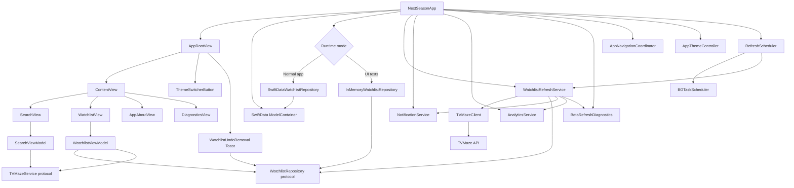

# NextSeason TV — App Architecture

```mermaid
flowchart TB
    App[NextSeasonApp] --> Root[AppRootView]
    Root --> Content[ContentView]

    App --> ModelContainer[SwiftData ModelContainer]
    App --> RepoChoice{Runtime mode}
    RepoChoice -->|Normal app| SwiftDataRepo[SwiftDataWatchlistRepository]
    RepoChoice -->|UI tests| MemoryRepo[InMemoryWatchlistRepository]

    App --> RefreshService[WatchlistRefreshService]
    App --> NotificationService[NotificationService]
    App --> Analytics[AnalyticsService]
    App --> BetaDiagnostics[BetaRefreshDiagnostics]
    App --> NavCoordinator[AppNavigationCoordinator]
    App --> ThemeController[AppThemeController]

    RefreshService --> TVMazeClient[TVMazeClient]
    RefreshService --> Repo[WatchlistRepository protocol]
    RefreshService --> NotificationService
    RefreshService --> Analytics
    RefreshService --> BetaDiagnostics

    Content --> SearchView[SearchView]
    Content --> WatchlistView[WatchlistView]
    Content --> AboutSheet[AppAboutView]
    Content --> DiagnosticsSheet[DiagnosticsView]

    SearchView --> SearchVM[SearchViewModel]
    WatchlistView --> WatchlistVM[WatchlistViewModel]
    SearchVM --> TVMazeProtocol[TVMazeService protocol]
    WatchlistVM --> Repo
    WatchlistVM --> TVMazeProtocol

    SwiftDataRepo --> ModelContainer
    MemoryRepo --> Repo
    TVMazeClient --> TVMazeAPI[TVMaze API]

    Root --> ThemeSwitcher[ThemeSwitcherButton]
    Root --> UndoToast[WatchlistUndoRemoval Toast]
    UndoToast --> Repo

    App --> RefreshScheduler[RefreshScheduler]
    RefreshScheduler --> BackgroundTasks[BGTaskScheduler]
    RefreshScheduler --> RefreshService
```
