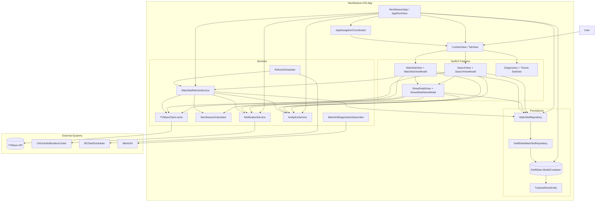

# NextSeason System Architecture

## Notes

The MVP remains a local-first iOS app. The app has no user accounts, backend, or cloud sync. TVMaze is the only external data provider used by the running product.
