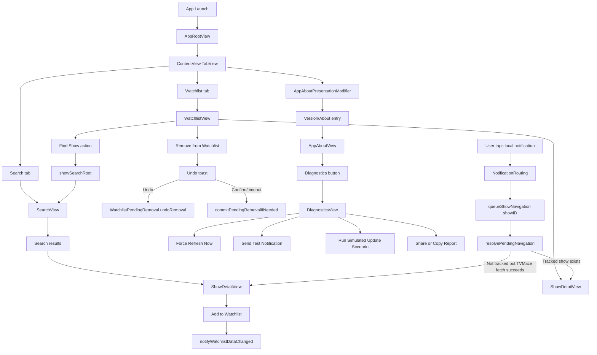

# NextSeason TV — Navigation and Screens

```mermaid
flowchart TD
    Launch[App Launch] --> Root[AppRootView]
    Root --> Tabs[ContentView TabView]

    Tabs --> SearchTab[Search tab]
    Tabs --> WatchlistTab[Watchlist tab]

    SearchTab --> SearchRoot[SearchView]
    SearchRoot --> SearchResults[Search results]
    SearchResults --> SearchDetail[ShowDetailView]
    SearchDetail --> AddWatchlist[Add to Watchlist]
    AddWatchlist --> WatchlistChanged[notifyWatchlistDataChanged]

    WatchlistTab --> WatchlistRoot[WatchlistView]
    WatchlistRoot --> WatchlistDetail[ShowDetailView]
    WatchlistRoot --> FindShow[Find Show action]
    FindShow --> ResetSearch[showSearchRoot]
    ResetSearch --> SearchRoot

    WatchlistRoot --> RemoveShow[Remove from Watchlist]
    RemoveShow --> UndoToast[Undo toast]
    UndoToast -->|Undo| RestoreShow[WatchlistPendingRemoval.undoRemoval]
    UndoToast -->|Confirm/timeout| CommitRemoval[commitPendingRemovalIfNeeded]

    Tabs --> AboutModifier[AppAboutPresentationModifier]
    AboutModifier --> AboutEntry[Version/About entry]
    AboutEntry --> AboutSheet[AppAboutView]
    AboutSheet --> DiagnosticsButton[Diagnostics button]
    DiagnosticsButton --> DiagnosticsSheet[DiagnosticsView]

    DiagnosticsSheet --> ForceRefresh[Force Refresh Now]
    DiagnosticsSheet --> TestNotification[Send Test Notification]
    DiagnosticsSheet --> SimulatedUpdate[Run Simulated Update Scenario]
    DiagnosticsSheet --> ShareReport[Share or Copy Report]

    NotificationTap[User taps local notification] --> NotificationRouting[NotificationRouting]
    NotificationRouting --> QueueShow[queueShowNavigation showID]
    QueueShow --> ResolvePending[resolvePendingNavigation]
    ResolvePending -->|Tracked show exists| WatchlistDetail
    ResolvePending -->|Not tracked but TVMaze fetch succeeds| SearchDetail
```
