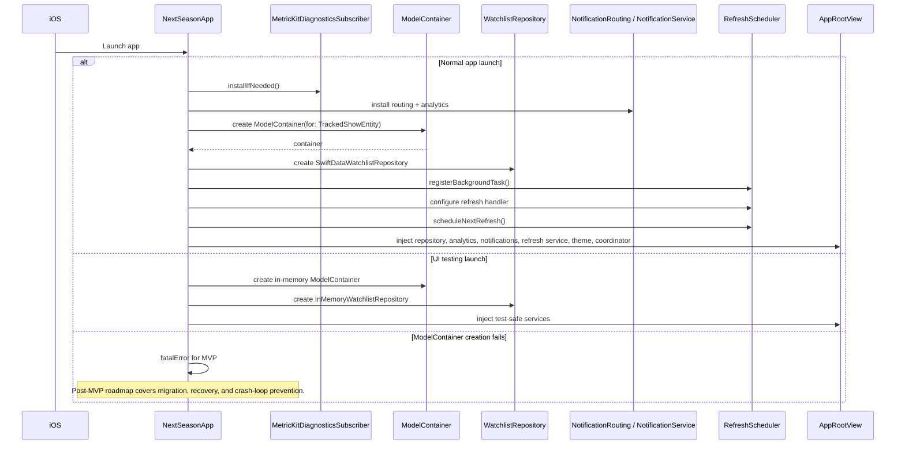

# App Startup and Environment Setup

## Notes

Persistence is created at app startup because the app cannot function meaningfully without a watchlist store. For MVP, container creation failure is treated as unrecoverable; a user-facing recovery flow is deferred to the post-MVP roadmap.
