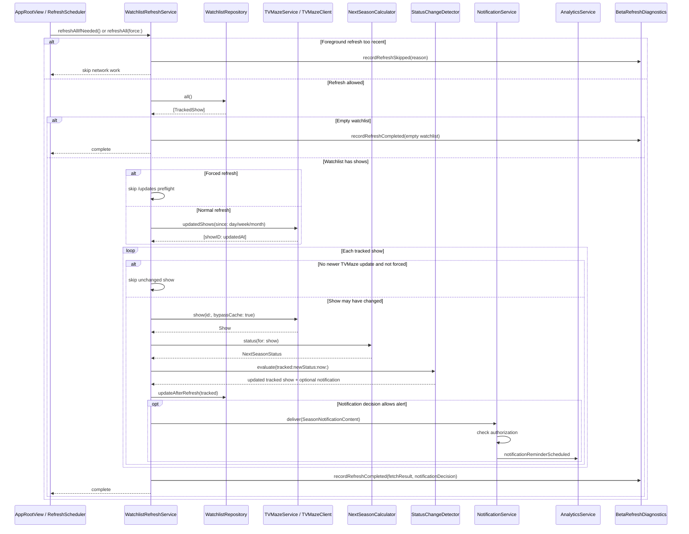
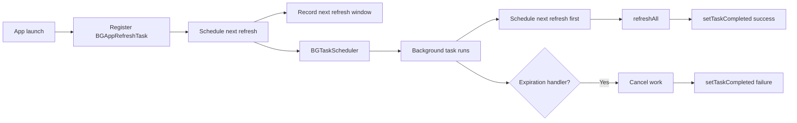

# NextSeason TV — Watchlist Refresh and Notifications

```mermaid
sequenceDiagram
    participant App as AppRootView / RefreshScheduler
    participant Refresh as WatchlistRefreshService
    participant Repo as WatchlistRepository
    participant TVMaze as TVMazeService / TVMazeClient
    participant Calc as NextSeasonCalculator
    participant Detector as StatusChangeDetector
    participant Notify as NotificationService
    participant Analytics as AnalyticsService
    participant Diag as BetaRefreshDiagnostics

    App->>Refresh: refreshAllIfNeeded() or refreshAll(force:)
    alt Foreground refresh too recent
        Refresh->>Diag: recordRefreshSkipped(reason)
        Refresh-->>App: skip network work
    else Refresh allowed
        Refresh->>Repo: all()
        Repo-->>Refresh: [TrackedShow]

        alt Empty watchlist
            Refresh->>Diag: recordRefreshCompleted(empty watchlist)
            Refresh-->>App: complete
        else Watchlist has shows
            alt Forced refresh
                Refresh->>Refresh: skip /updates preflight
            else Normal refresh
                Refresh->>TVMaze: updatedShows(since: day/week/month)
                TVMaze-->>Refresh: [showID: updatedAt]
            end

            loop Each tracked show
                alt No newer TVMaze update and not forced
                    Refresh->>Refresh: skip unchanged show
                else Show may have changed
                    Refresh->>TVMaze: show(id:, bypassCache: true)
                    TVMaze-->>Refresh: Show
                    Refresh->>Calc: status(for: show)
                    Calc-->>Refresh: NextSeasonStatus
                    Refresh->>Detector: evaluate(tracked:newStatus:now:)
                    Detector-->>Refresh: updated tracked show + optional notification
                    Refresh->>Repo: updateAfterRefresh(tracked)
                    opt Notification decision allows alert
                        Refresh->>Notify: deliver(SeasonNotificationContent)
                        Notify->>Notify: check authorization
                        Notify->>Analytics: notificationReminderScheduled
                    end
                end
            end

            Refresh->>Diag: recordRefreshCompleted(fetchResult, notificationDecision)
            Refresh-->>App: complete
        end
    end
```

```mermaid
flowchart LR
    Launch[App launch] --> Register[Register BGAppRefreshTask]
    Register --> Schedule[Schedule next refresh]
    Schedule --> DiagNext[Record next refresh window]
    Schedule --> System[BGTaskScheduler]
    System --> TaskRuns[Background task runs]
    TaskRuns --> Reschedule[Schedule next refresh first]
    Reschedule --> RefreshAll[refreshAll]
    RefreshAll --> Complete[setTaskCompleted success]
    TaskRuns --> Expire{Expiration handler?}
    Expire -->|Yes| Cancel[Cancel work]
    Cancel --> CompleteFail[setTaskCompleted failure]
```
