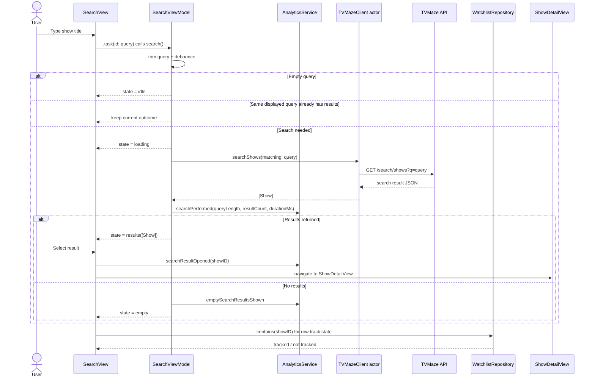

# Search Flow

```mermaid
sequenceDiagram
    actor User
    participant SearchView
    participant VM as SearchViewModel
    participant Analytics as AnalyticsService
    participant API as TVMazeClient actor
    participant TVMaze as TVMaze API
    participant Repo as WatchlistRepository
    participant Detail as ShowDetailView

    User->>SearchView: Type show title
    SearchView->>VM: .task(id: query) calls search()
    VM->>VM: trim query + debounce

    alt Empty query
        VM-->>SearchView: state = idle
    else Same displayed query already has results
        VM-->>SearchView: keep current outcome
    else Search needed
        VM-->>SearchView: state = loading
        VM->>API: searchShows(matching: query)
        API->>TVMaze: GET /search/shows?q=query
        TVMaze-->>API: search result JSON
        API-->>VM: [Show]
        VM->>Analytics: searchPerformed(queryLength, resultCount, durationMs)

        alt Results returned
            VM-->>SearchView: state = results([Show])
            User->>SearchView: Select result
            SearchView->>Analytics: searchResultOpened(showID)
            SearchView->>Detail: navigate to ShowDetailView
        else No results
            VM->>Analytics: emptySearchResultsShown
            VM-->>SearchView: state = empty
        end
    end

    SearchView->>Repo: contains(showID) for row track state
    Repo-->>SearchView: tracked / not tracked
```

## Notes

Search text is not recorded in analytics. Only query length, result count, and timing are logged.
