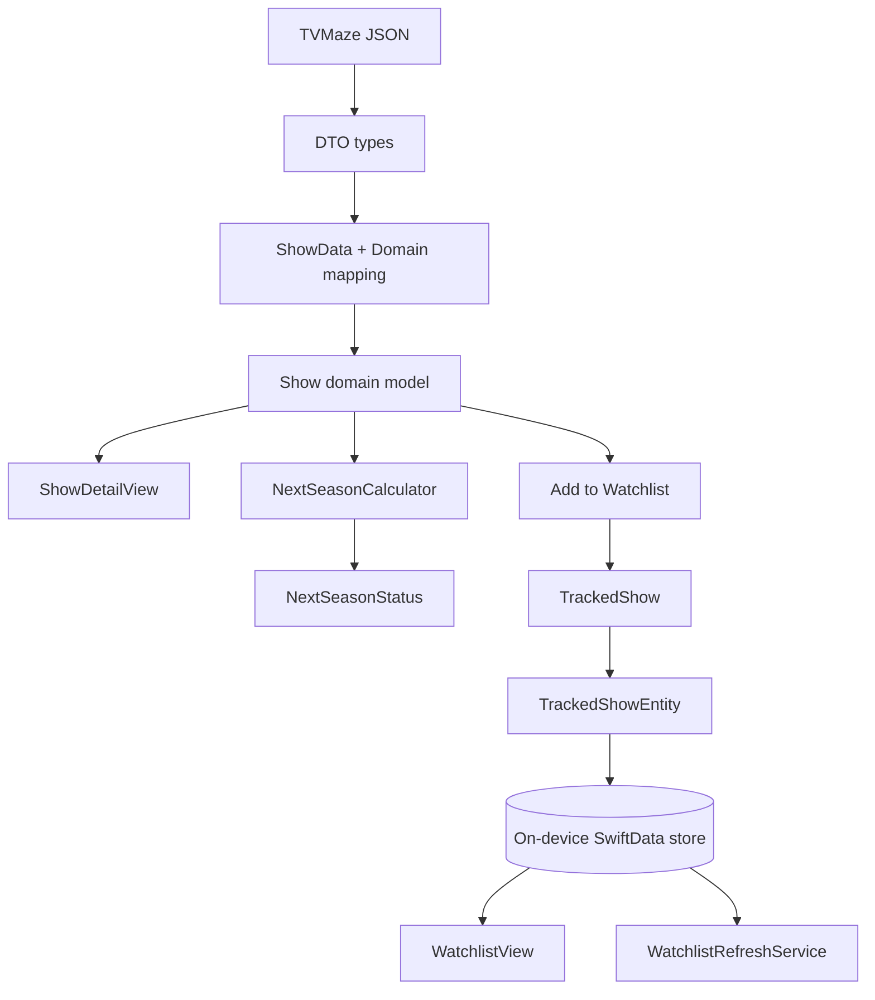

# NextSeason TV — Data and Persistence Model

```mermaid
classDiagram
    class TVMazeService {
        <<protocol>>
        +searchShows(query) [Show]
        +show(id,bypassCache) Show
        +updatedShows(period) [Int:Date]
    }

    class TVMazeClient
    TVMazeService <|.. TVMazeClient

    class ShowData {
        DTO from TVMaze
    }
    class SeasonData
    class NextEpisodeData
    class NetworkData
    class ImageData

    ShowData --> SeasonData
    ShowData --> NextEpisodeData
    ShowData --> NetworkData
    ShowData --> ImageData

    class Show {
        +id
        +name
        +status
        +seasons
        +nextEpisode
        +updatedAt
    }
    class Season
    class NextEpisode
    class NextSeasonStatus
    class ShowStatus

    Show --> Season
    Show --> NextEpisode
    Show --> ShowStatus
    Show --> NextSeasonStatus
    ShowData ..> Show : mapping

    class TrackedShow {
        +id
        +name
        +nextSeason
        +sourceUpdatedAt
        +lastCheckedAt
        +lastNotifiedSignature
        +pendingChangeSignature
        +isStale
        +dateAdded
    }

    class TrackedShowEntity {
        SwiftData model
    }

    Show ..> TrackedShow : init(from:)
    TrackedShowEntity ..> TrackedShow : toDomain/apply
    TrackedShow --> NextSeasonStatus
    TrackedShow --> ShowStatus

    class WatchlistRepository {
        <<protocol>>
        +all()
        +contains(showID)
        +add(show)
        +remove(showID)
        +updateAfterRefresh(tracked)
    }

    class SwiftDataWatchlistRepository
    class InMemoryWatchlistRepository

    WatchlistRepository <|.. SwiftDataWatchlistRepository
    WatchlistRepository <|.. InMemoryWatchlistRepository
    SwiftDataWatchlistRepository --> TrackedShowEntity
    InMemoryWatchlistRepository --> TrackedShow
```


