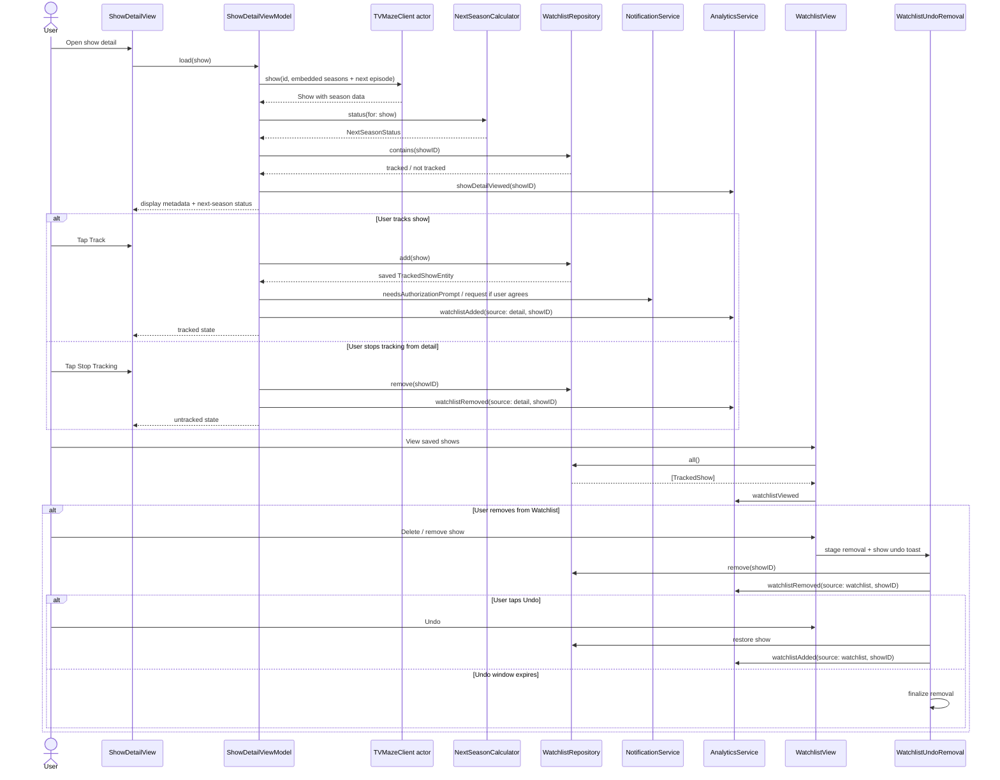

# Show Detail and Watchlist Flow

## Notes

The current watchlist removal flow keeps the list mounted and uses the undo coordinator to avoid the crash-prone empty-list transition that previously occurred during deletion.
