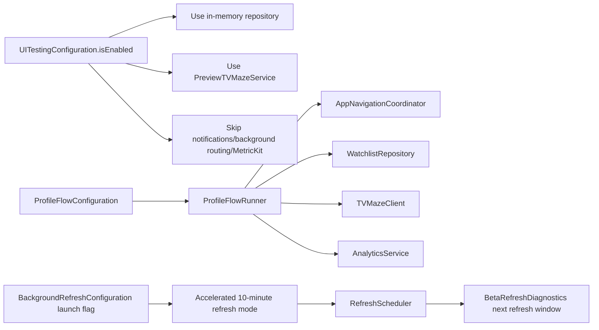

# NextSeason TV — Beta Diagnostics and Testing

```mermaid
flowchart TB
    BuildCheck[BetaBuildAvailability] --> Available{Debug or TestFlight?}
    Available -->|No| NormalUI[No beta diagnostics entry]
    Available -->|Yes| VersionEntry[Version/About entry]
    VersionEntry --> About[AppAboutView]
    About --> Diagnostics[DiagnosticsView]

    Diagnostics --> AppInfo[Version, build channel, theme, notification status]
    Diagnostics --> BetaValidation[Beta validation section]
    Diagnostics --> LaunchInvestigation[Launch investigation breadcrumbs]
    Diagnostics --> UsageCounters[Local usage counters]
    Diagnostics --> ShareControls[Share Report / Copy Report]

    BetaValidation --> BackgroundRefresh[Last background refresh]
    BetaValidation --> NextRefresh[Next refresh window]
    BetaValidation --> BackgroundFetch[Last background fetch result]
    BetaValidation --> BackgroundDecision[Last background notification decision]
    BetaValidation --> ForegroundRefresh[Last foreground refresh]
    BetaValidation --> ForegroundFetch[Last foreground fetch result]
    BetaValidation --> ForegroundDecision[Last foreground notification decision]
    BetaValidation --> LastSimulation[Last simulation summary]

    Diagnostics --> ForceRefresh[Force Refresh Now]
    ForceRefresh --> RefreshService[WatchlistRefreshService.refreshAll(force: true)]
    RefreshService --> ForegroundDiagnostics[BetaRefreshDiagnostics foreground fields]

    Scheduler[RefreshScheduler BGAppRefreshTask] --> RefreshServiceBackground[WatchlistRefreshService.refreshAll(recordDiagnostics: true)]
    RefreshServiceBackground --> BackgroundDiagnostics[BetaRefreshDiagnostics background fields persisted]

    Diagnostics --> TestNotification[Send Test Notification]
    TestNotification --> NotificationService[NotificationService]

    Diagnostics --> SimScenario[Run Simulated Update Scenario]
    SimScenario --> SimRunner[DiagnosticsSimulatedUpdateRunner]
    SimRunner --> FakeData[DiagnosticsSimulatedDataProvider]
    SimRunner --> NotificationService
    SimRunner --> SimSummary[BetaRefreshDiagnostics last simulation]
    SimRunner --> Analytics[AnalyticsService]
```


