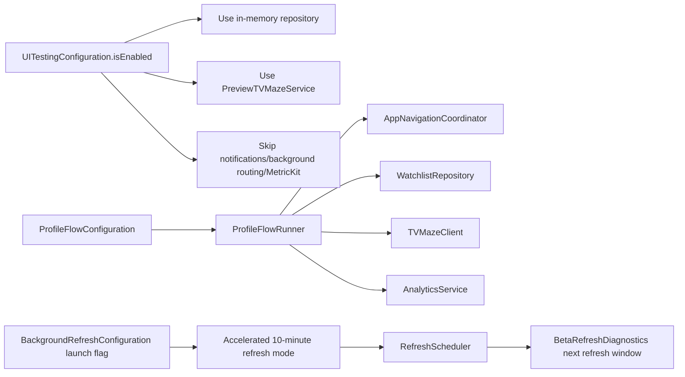

# NextSeason TV — Beta Diagnostics and Testing

```mermaid
flowchart TB
    BuildCheck[BetaBuildAvailability] --> Available{Debug or TestFlight?}
    Available -->|No| NormalUI[No beta diagnostics entry]
    Available -->|Yes| VersionEntry[Version/About entry]
    VersionEntry --> About[AppAboutView]
    About --> Diagnostics[DiagnosticsView]

    Diagnostics --> AppInfo[Version, build channel, theme, notification status]
    Diagnostics --> BetaValidation[Beta validation section]
    Diagnostics --> LaunchInvestigation[Launch investigation breadcrumbs]
    Diagnostics --> UsageCounters[Local usage counters]
    Diagnostics --> ShareControls[Share Report / Copy Report]

    BetaValidation --> LastRefresh[Last refresh]
    BetaValidation --> NextRefresh[Next refresh window]
    BetaValidation --> LastFetch[Last fetch result]
    BetaValidation --> LastDecision[Last notification decision]
    BetaValidation --> LastSimulation[Last simulation summary]

    Diagnostics --> ForceRefresh[Force Refresh Now]
    ForceRefresh --> RefreshService[WatchlistRefreshService.refreshAll(force: true)]
    RefreshService --> BetaRefreshDiagnostics[BetaRefreshDiagnostics]

    Diagnostics --> TestNotification[Send Test Notification]
    TestNotification --> NotificationService[NotificationService]

    Diagnostics --> SimScenario[Run Simulated Update Scenario]
    SimScenario --> SimRunner[DiagnosticsSimulatedUpdateRunner]
    SimRunner --> FakeData[DiagnosticsSimulatedDataProvider]
    SimRunner --> NotificationService
    SimRunner --> BetaRefreshDiagnostics
    SimRunner --> Analytics[AnalyticsService]
```


