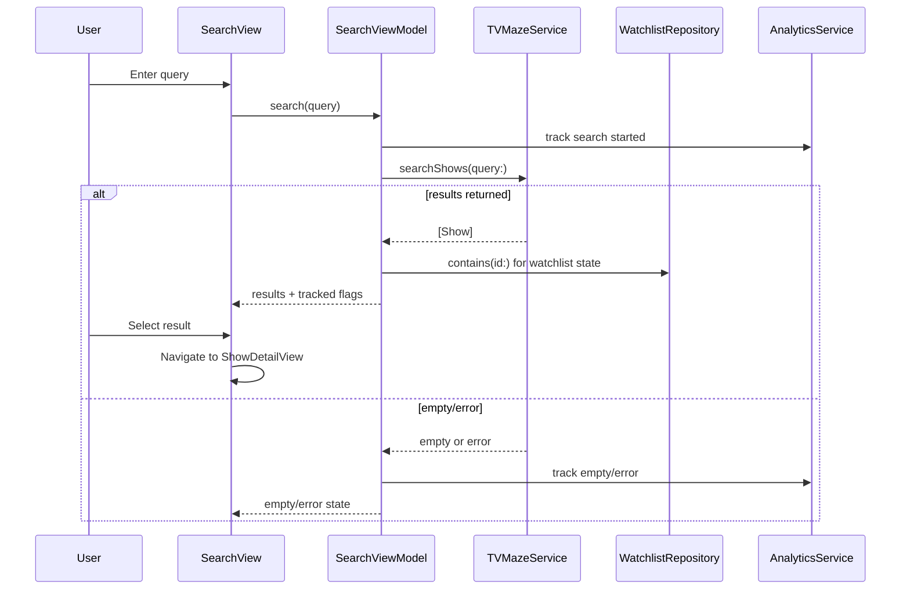

# 05 — Search Flow

```mermaid
sequenceDiagram
    participant User
    participant View as SearchView
    participant VM as SearchViewModel
    participant TVMaze as TVMazeService
    participant Repo as WatchlistRepository
    participant Analytics as AnalyticsService

    User->>View: Enter query
    View->>VM: search(query)
    VM->>Analytics: track search started
    VM->>TVMaze: searchShows(query:)
    alt results returned
        TVMaze-->>VM: [Show]
        VM->>Repo: contains(id:) for watchlist state
        VM-->>View: results + tracked flags
        User->>View: Select result
        View->>View: Navigate to ShowDetailView
    else empty/error
        TVMaze-->>VM: empty or error
        VM->>Analytics: track empty/error
        VM-->>View: empty/error state
    end
```
