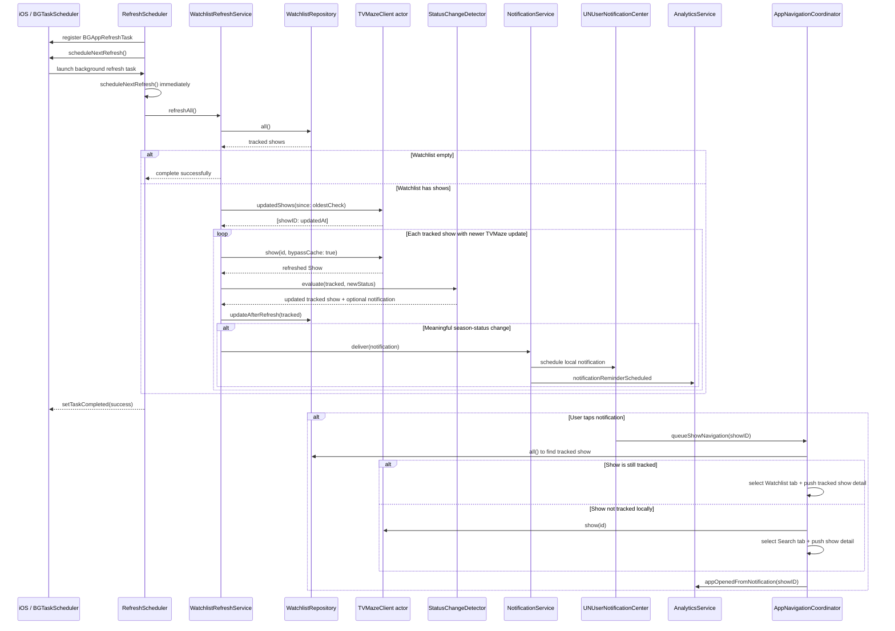

# Background Refresh and Notification Flow

## Notes

Background refresh is best-effort. iOS controls when and whether the refresh task runs. The app schedules the next refresh when handling the current task and guards task completion so `setTaskCompleted` is called at most once.
