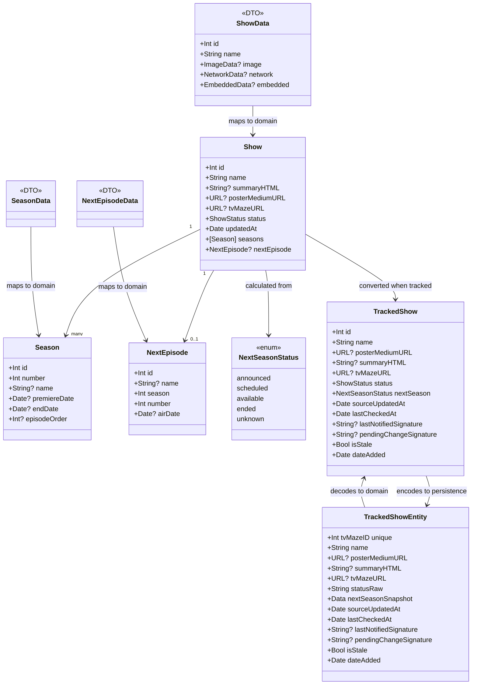

# Current Data Model

## Notes

`TrackedShowEntity` stores `NextSeasonStatus` as encoded data. This keeps the persisted watchlist compact, but future schema changes should be covered by a SwiftData migration plan and migration testing.
