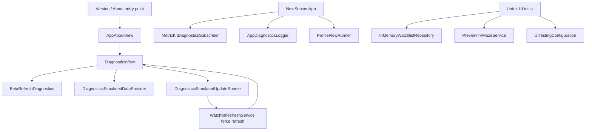

# 07 — Beta Diagnostics and Testing

```mermaid
flowchart TD
    VersionButton[Version / About entry point] --> About[AppAboutView]
    About --> Diagnostics[DiagnosticsView]
    Diagnostics --> BetaDiag[BetaRefreshDiagnostics]
    Diagnostics --> SimProvider[DiagnosticsSimulatedDataProvider]
    Diagnostics --> SimRunner[DiagnosticsSimulatedUpdateRunner]
    SimRunner --> Refresh[WatchlistRefreshService force refresh]
    Refresh --> Diagnostics
    App[NextSeasonApp] --> MetricKit[MetricKitDiagnosticsSubscriber]
    App --> Logger[AppDiagnosticsLogger]
    App --> ProfileFlow[ProfileFlowRunner]
    Tests[Unit + UI tests] --> InMemoryRepo[InMemoryWatchlistRepository]
    Tests --> PreviewTVMaze[PreviewTVMazeService]
    Tests --> UITestingConfig[UITestingConfiguration]
```
