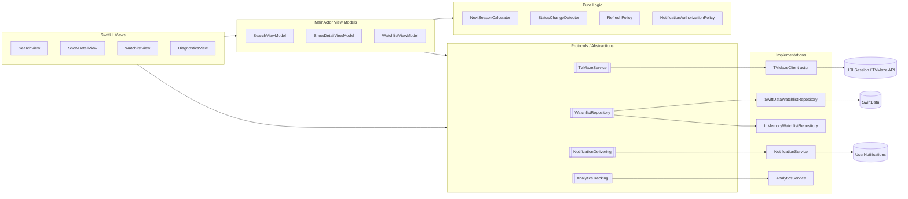

# Dependencies and Boundaries

## Notes

The important portfolio boundary is that UI code depends on protocols and services rather than directly on URL construction, SwiftData fetches, or notification scheduling.
