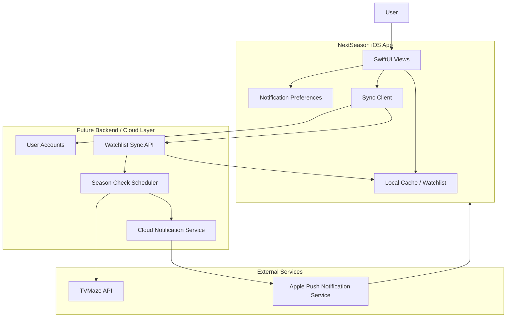

# Post-MVP Architecture

## Purpose

This diagram shows what a post-MVP version might add on top of the current MVP:

- User accounts
- Cloud-synced watchlists
- Server-side scheduled season checks
- **Push notifications** (via APNs and a backend notification service)

## Relationship to the MVP

The MVP already includes **local notifications** scheduled on-device when watchlist
season status changes (`NotificationService`, `RefreshScheduler`, and
`BGTaskScheduler`). Those are not shown here because they do not require accounts,
cloud sync, or push infrastructure.

Post-MVP work would add **push/cloud notifications** so alerts can reach the user
even when the app has not run recently, plus the account and sync layer that
supports cross-device watchlists.
