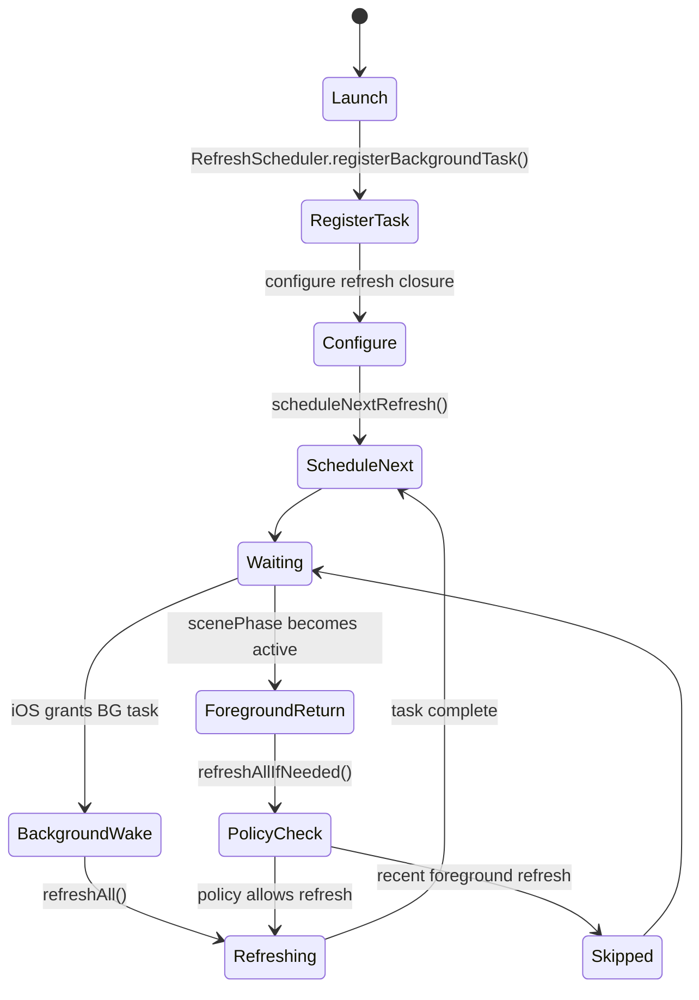

# 08 — Background Refresh Scheduling

```mermaid
stateDiagram-v2
    [*] --> Launch
    Launch --> RegisterTask: RefreshScheduler.registerBackgroundTask()
    RegisterTask --> Configure: configure refresh closure
    Configure --> ScheduleNext: scheduleNextRefresh()
    ScheduleNext --> Waiting
    Waiting --> BackgroundWake: iOS grants BG task
    BackgroundWake --> Refreshing: refreshAll()
    Refreshing --> ScheduleNext: task complete
    Waiting --> ForegroundReturn: scenePhase becomes active
    ForegroundReturn --> PolicyCheck: refreshAllIfNeeded()
    PolicyCheck --> Skipped: recent foreground refresh
    PolicyCheck --> Refreshing: policy allows refresh
    Skipped --> Waiting
```
