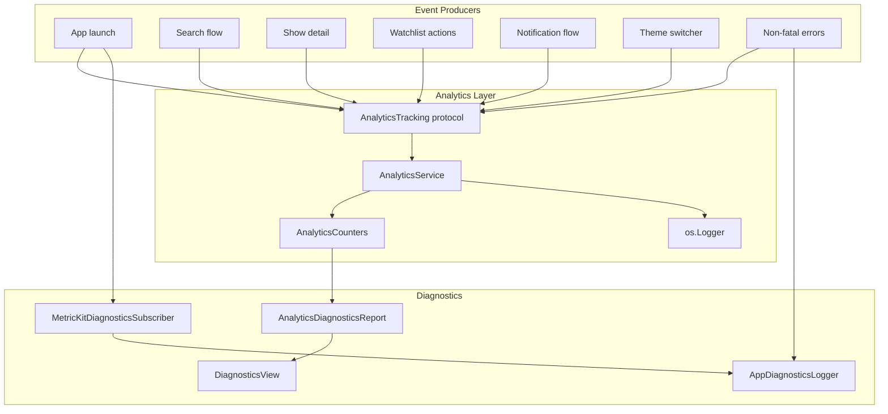

# Analytics and Diagnostics

## Notes

The MVP uses local structured logging and local aggregate counters. It intentionally avoids collecting search text, show titles, user identifiers, or other PII. Remote analytics can be added post-MVP by implementing the same `AnalyticsTracking` protocol.
