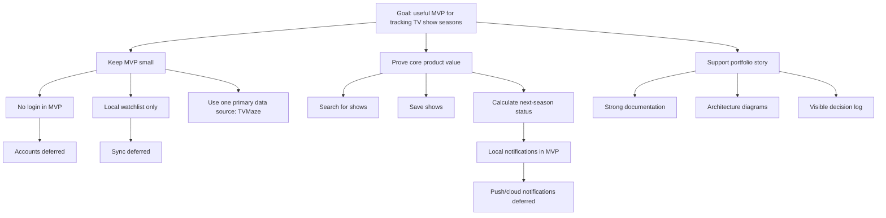

# Architecture Decision Context

## Purpose

This diagram captures why the MVP is shaped the way it is.

The key decision is not that accounts, sync, or push notifications are unimportant.
It is that they should come after the app proves the basic watchlist and
season-status experience. **Local notifications** are part of the MVP; **push
and cloud-delivered notifications** remain post-MVP.
