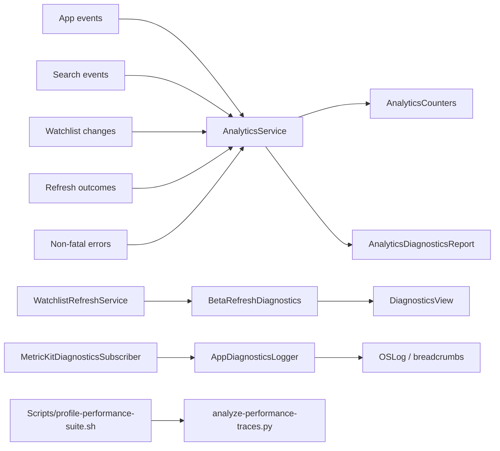

# 09 — Analytics and Diagnostics

```mermaid
flowchart LR
    AppEvents[App events] --> Analytics[AnalyticsService]
    SearchEvents[Search events] --> Analytics
    WatchlistEvents[Watchlist changes] --> Analytics
    RefreshEvents[Refresh outcomes] --> Analytics
    Errors[Non-fatal errors] --> Analytics
    Analytics --> Counters[AnalyticsCounters]
    Analytics --> Report[AnalyticsDiagnosticsReport]
    Refresh[WatchlistRefreshService] --> BetaDiag[BetaRefreshDiagnostics]
    BetaDiag --> DiagnosticsView[DiagnosticsView]
    Logger[AppDiagnosticsLogger] --> Console[OSLog / breadcrumbs]
    MetricKit[MetricKitDiagnosticsSubscriber] --> Logger
    ProfileScripts[Scripts/profile-performance-suite.sh] --> TraceAnalysis[analyze-performance-traces.py]
```
