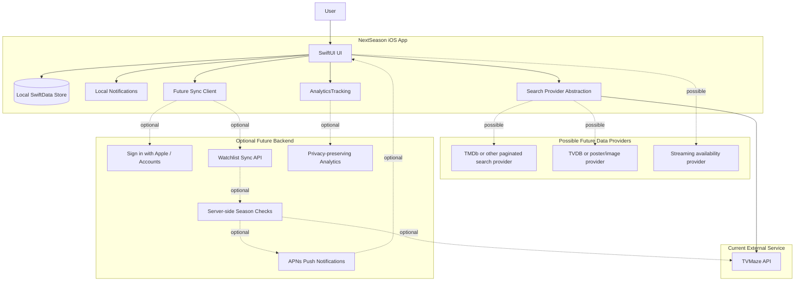

# Post-MVP Architecture Options

## Notes

Post-MVP expansion should be driven by beta feedback and analytics. The highest-value likely additions are improved search, streaming availability, notification preferences, and persistence recovery/migration support.
