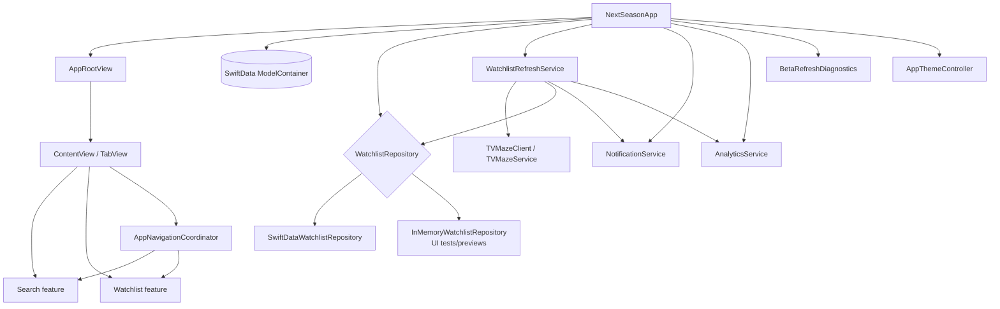

# 01 — App Architecture

```mermaid
flowchart TD
    App[NextSeasonApp] --> Root[AppRootView]
    Root --> Content[ContentView / TabView]
    Content --> Search[Search feature]
    Content --> Watchlist[Watchlist feature]
    App --> SwiftData[(SwiftData ModelContainer)]
    App --> Repo{WatchlistRepository}
    Repo --> SwiftRepo[SwiftDataWatchlistRepository]
    Repo --> MemoryRepo[InMemoryWatchlistRepository
UI tests/previews]
    App --> Refresh[WatchlistRefreshService]
    App --> Notifications[NotificationService]
    App --> Analytics[AnalyticsService]
    App --> Diagnostics[BetaRefreshDiagnostics]
    App --> Theme[AppThemeController]
    Refresh --> TVMaze[TVMazeClient / TVMazeService]
    Refresh --> Repo
    Refresh --> Notifications
    Refresh --> Analytics
    Content --> Coordinator[AppNavigationCoordinator]
    Coordinator --> Search
    Coordinator --> Watchlist
```
