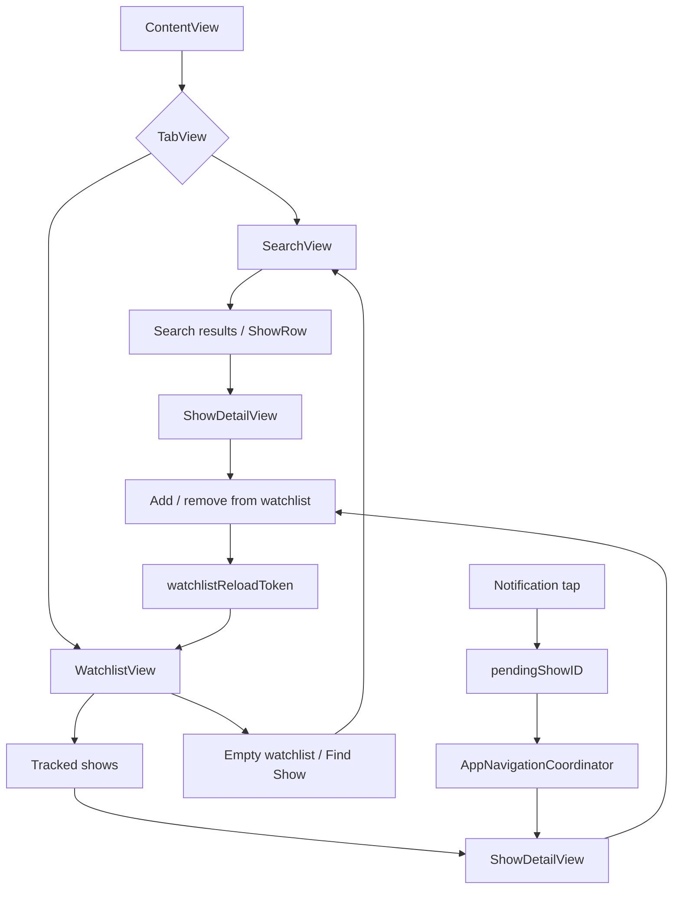

# 02 — Navigation and Screens

```mermaid
flowchart TD
    Content[ContentView] --> Tabs{TabView}
    Tabs --> SearchRoot[SearchView]
    Tabs --> WatchlistRoot[WatchlistView]
    SearchRoot --> SearchResults[Search results / ShowRow]
    SearchResults --> SearchDetail[ShowDetailView]
    WatchlistRoot --> TrackedRows[Tracked shows]
    TrackedRows --> WatchlistDetail[ShowDetailView]
    WatchlistRoot --> EmptyState[Empty watchlist / Find Show]
    EmptyState --> SearchRoot
    SearchDetail --> AddRemove[Add / remove from watchlist]
    WatchlistDetail --> AddRemove
    AddRemove --> ReloadToken[watchlistReloadToken]
    ReloadToken --> WatchlistRoot
    NotificationTap[Notification tap] --> PendingShowID[pendingShowID]
    PendingShowID --> Coordinator[AppNavigationCoordinator]
    Coordinator --> WatchlistDetail
```
