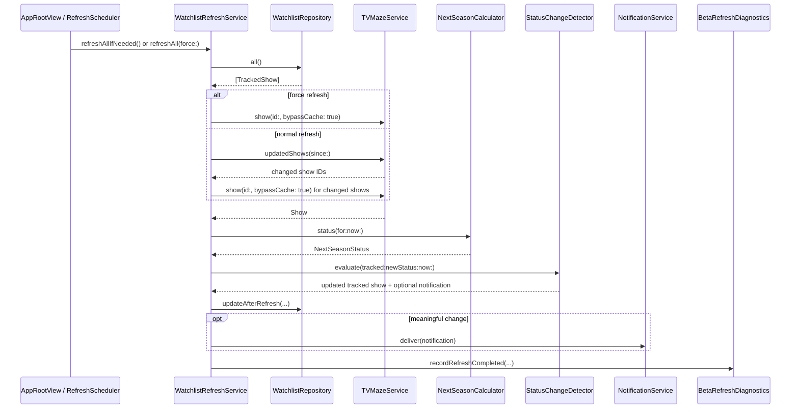

# 03 — Watchlist Refresh and Notifications

```mermaid
sequenceDiagram
    participant App as AppRootView / RefreshScheduler
    participant Refresh as WatchlistRefreshService
    participant Repo as WatchlistRepository
    participant TVMaze as TVMazeService
    participant Calc as NextSeasonCalculator
    participant Detector as StatusChangeDetector
    participant Notify as NotificationService
    participant Diag as BetaRefreshDiagnostics

    App->>Refresh: refreshAllIfNeeded() or refreshAll(force:)
    Refresh->>Repo: all()
    Repo-->>Refresh: [TrackedShow]
    alt force refresh
        Refresh->>TVMaze: show(id:, bypassCache: true)
    else normal refresh
        Refresh->>TVMaze: updatedShows(since:)
        TVMaze-->>Refresh: changed show IDs
        Refresh->>TVMaze: show(id:, bypassCache: true) for changed shows
    end
    TVMaze-->>Refresh: Show
    Refresh->>Calc: status(for:now:)
    Calc-->>Refresh: NextSeasonStatus
    Refresh->>Detector: evaluate(tracked:newStatus:now:)
    Detector-->>Refresh: updated tracked show + optional notification
    Refresh->>Repo: updateAfterRefresh(...)
    opt meaningful change
        Refresh->>Notify: deliver(notification)
    end
    Refresh->>Diag: recordRefreshCompleted(...)
```
