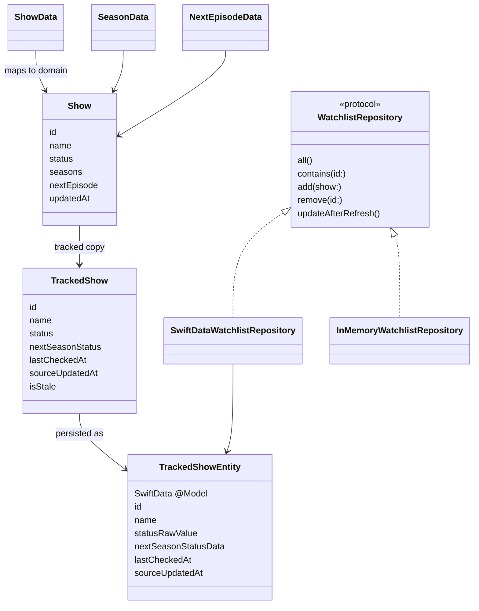

# 04 — Data and Persistence

```mermaid
classDiagram
    class Show {
        id
        name
        status
        seasons
        nextEpisode
        updatedAt
    }
    class TrackedShow {
        id
        name
        status
        nextSeasonStatus
        lastCheckedAt
        sourceUpdatedAt
        isStale
    }
    class TrackedShowEntity {
        SwiftData @Model
        id
        name
        statusRawValue
        nextSeasonStatusData
        lastCheckedAt
        sourceUpdatedAt
    }
    class WatchlistRepository {
        <<protocol>>
        all()
        contains(id:)
        add(show:)
        remove(id:)
        updateAfterRefresh()
    }
    class SwiftDataWatchlistRepository
    class InMemoryWatchlistRepository
    class ShowData
    class SeasonData
    class NextEpisodeData

    ShowData --> Show : maps to domain
    SeasonData --> Show
    NextEpisodeData --> Show
    Show --> TrackedShow : tracked copy
    TrackedShow --> TrackedShowEntity : persisted as
    WatchlistRepository <|.. SwiftDataWatchlistRepository
    WatchlistRepository <|.. InMemoryWatchlistRepository
    SwiftDataWatchlistRepository --> TrackedShowEntity
```
