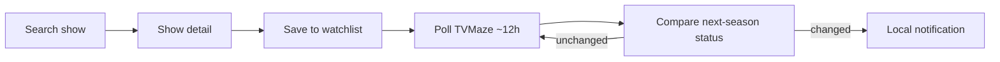

# Product Spec

Single source of truth for what NextSeason is and what its first slice delivers.
This consolidates the Phase 1/2 product documents; it does not replace them. For
depth, see the source docs linked below.

- Problem: [`ProblemStatement.md`](ProblemStatement.md)
- Scope: [`MVPDefinition.md`](MVPDefinition.md)
- Backlog: [`MVPBacklog.md`](MVPBacklog.md)
- Requirements: [`FunctionalRequirements.md`](FunctionalRequirements.md)
- User stories: [`UserStories.md`](UserStories.md)
- Decisions: [`DecisionLog.md`](DecisionLog.md)
- Architecture: [`Architecture.md`](Architecture.md)
- API research: [`TVMazeResearch.md`](TVMazeResearch.md)

---

## 1. One-liner

NextSeason answers a single question for TV fans: **"Is there a next season of
this show, and when does it arrive?"** — and (in a later phase) tells you when
that answer changes for shows you've saved.

## Terminology

To avoid ambiguity (earlier notes overloaded the term "v0.1"):

- **MVP** — the full first release defined in [`MVPDefinition.md`](MVPDefinition.md):
  search + watchlist + notifications. This is what some earlier notes called
  "v0.1".
- **Slice** — a vertical implementation increment of the MVP. The MVP is built in
  two slices:
  - **Slice 1 — Guest Search:** search + show detail with next-season status.
    No accounts, no persistence, no notifications.
  - **Slice 2 — Save & Notify:** watchlist persistence + notifications +
    background refresh.

The term "v0.1" is intentionally avoided from here on.

## 2. Target user

A TV fan who finished the latest aired season of a show and wants to know if/when
the next one is coming, without combing through news sites, social media, or
streaming apps. Secondary traits (inform UX, not Slice 1 scope): cord-cutter /
multi-platform viewer who follows several shows at once.

## 3. Problem

Next-season information is fragmented, inconsistent, and easy to miss. Existing
tools bundle it with episode tracking, ratings, reviews, and social features that
add noise. NextSeason does one job well.

- **Slice 1 solves:** on-demand lookup of next-season status for any show.
- **Future solves:** passive monitoring — "tell me when something changes for the
  shows I care about."

## 4. Slice 1 scope — Guest Search

In scope:

- Search TV shows by title (TVMaze). (FR-001, FR-002, US-001)
- Display results with title, artwork, and status. (FR-003)
- Show detail screen with a clear **next-season status**: (FR-008–FR-010, US-002, US-006)
  - Next season number when known
  - Premiere date when known
  - A status label when no date exists ("In Production", "Returning",
    "Announced — date TBA", "Ended", "No next season known")
- Clear empty, loading, and error states (no results, network failure).
- Works fully without login or account.

Explicitly **not** in Slice 1 (planned for Slice 2, see §6):

- Saved watchlist + local persistence
- Notifications and background polling

## 5. Non-goals (project-wide)

To prevent scope creep in every phase, NextSeason is:

- **Not a streaming guide** — "where to watch" is not a primary feature.
- **Not an episode tracker** — no watch history or episode-level progress.
- **Not a social app** — no comments, ratings, reviews, or friend feeds.
- **Not multi-platform at launch** — iOS only.
- **Not a TVMaze replacement** — we consume their data and credit them.
- **Not real-time** — future notifications are poll-driven, not live.

## 6. Slice 2 — Save & Notify (context, not Slice 1 work)



A "status change" is any meaningful delta in next-season fields: date announced,
date changed, new season airing, or show ended. Field-level detail lives in
[`TVMazeResearch.md`](TVMazeResearch.md) §4–5; the architecture path is in
[`Architecture.md`](Architecture.md).

Slice 2 uses **on-device storage only** — no user accounts or sign-in. See
PD-001 in [`DecisionLog.md`](DecisionLog.md).

**Future enhancement (post-MVP):** Sign in with Apple and cloud-synced
watchlists, when cross-device sync justifies the added complexity.

## 7. Data source

**TVMaze** public REST API. No auth, JSON, CC BY-SA (requires crediting TVMaze
in-app). There is no direct "next season date" field — it is derived from the
show `status`, the embedded `seasons` list, and the embedded `nextepisode`. See
[`TVMazeResearch.md`](TVMazeResearch.md).

## 8. Success criteria

### Slice 1 is done when

- A guest can search any show (e.g. "Severance") and understand its next-season
  status on one screen.
- Empty/error/loading states are clear and never dead-end the user.
- It is obvious from the UI what Slice 1 does and does not do.
- The path to saved-shows + change-notifications is clear in the docs without
  being prescribed in code.

### The full MVP is successful when

A user can add shows to a watchlist, leave the app, and later receive a
notification when a new season becomes available — with no ongoing manual effort.
(See [`MVPDefinition.md`](MVPDefinition.md) success metrics.)

## 9. Phase status

- Phase 1 — Product definition: **done** (ChatGPT).
- Phase 2 — Research: **done** (ChatGPT).
- Phase 3 — Architecture: **done** — `ProductSpec.md`, `Architecture.md`,
  `TVMazeResearch.md` (Cursor / Claude).
- Phase 4 — Implementation: **in progress**. Slice 1 (Guest Search) = **done**.
  Next: Slice 2 (Save & Notify).
```