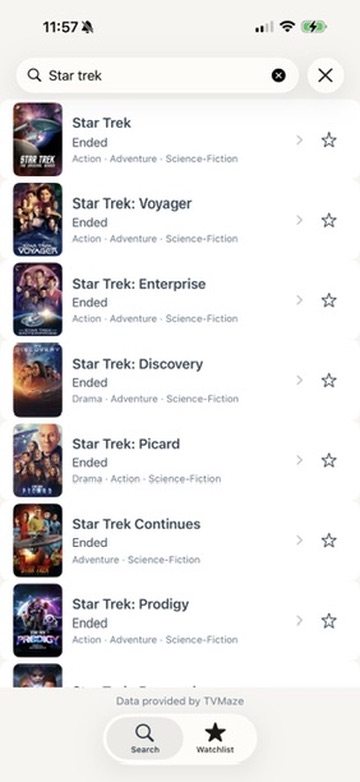
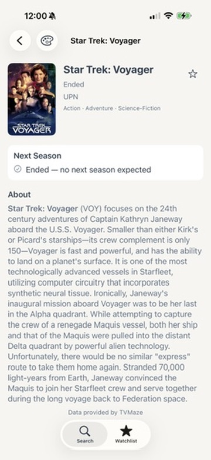
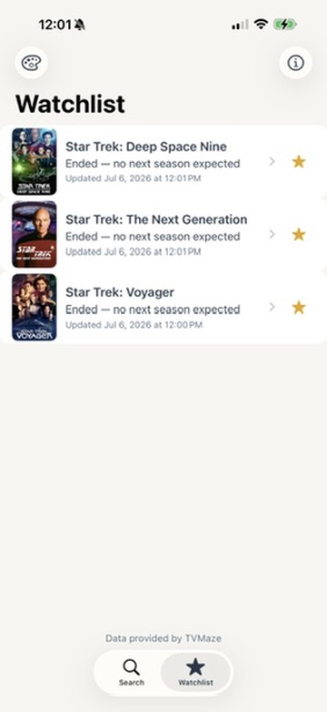

# NextSeason TV

### Built with

* Swift
* SwiftUI
* MVVM architecture
* Swift Concurrency
* TVMaze API
* Xcode
* XCTest and XCUITest
* Cursor + Claude
* ChatGPT

## What is NextSeason TV?

NextSeason TV is an iPhone app that lets users build a watchlist of television shows and receive notifications when a new season is announced.

It also serves as a portfolio app that demonstrates how I use modern AI tools to design, implement, review, and refine a production-quality SwiftUI application.

Version 1.0 is a focused, polished implementation of the core feature set (MVP), suitable for beta testing and inclusion in my portfolio. Development will continue as NextSeason TV grows up to become a Real App and joins the rest of the superheroes in the App Store.

This project was developed using an AI-assisted workflow. I directed the architecture, reviewed and refined AI-generated code, tested the application, made product and UX decisions, and iterated on the design throughout development.

## Screenshots

<table>

<tr>

<td align="center">

Search Results

</td>

<td align="center">

Show Details

</td>

<td align="center">

Watchlist

</td>

</tr>

</table>

## What's Here

This repository is intentionally transparent. In addition to the source code, it includes all of my discussions with AI (even including an occasional newbie question!). The goal is to demonstrate not only the finished product, but also the engineering process behind it.

Rather than cleaning up the development history, I’ve chosen to preserve it. The conversations, design documents, and planning notes show not just what was built, but how it was built, what alternatives were considered, and how decisions evolved over time.

## What's Next

This README is intentionally short due to time constraints but there is more to come.  Including, but not limited to:

* Features
* More Screenshots
* Architecture
* How AI was Used
* Building the Project
* Roadmap
